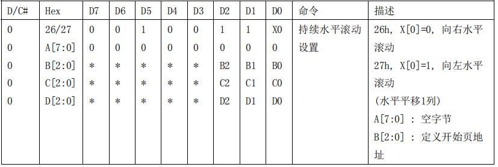
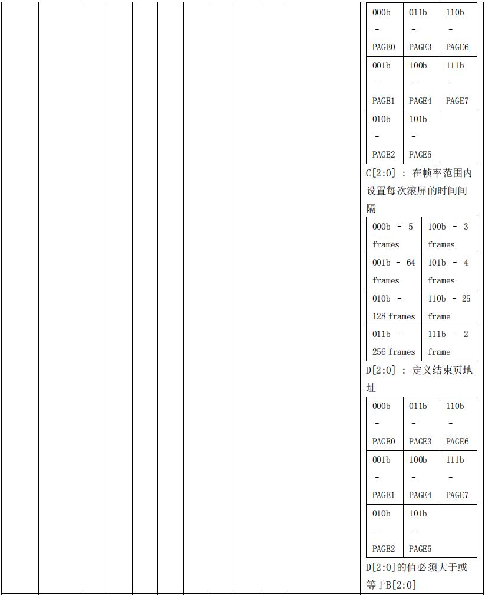
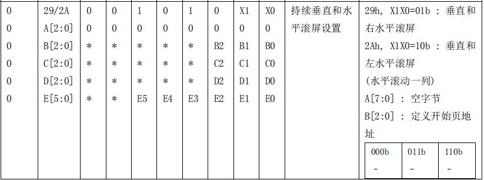
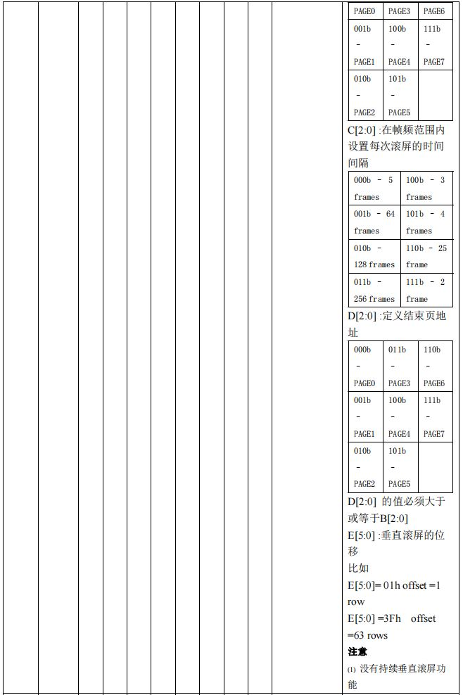
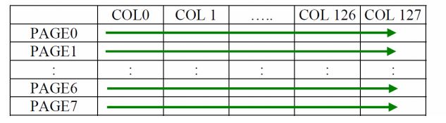
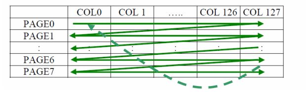
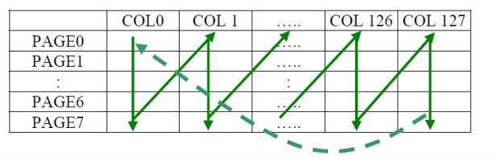

# STM32 HardWare OLED

## 1. OLED 简介

OLED 屏幕本质由众多 LED 组成。每个 LED 称为一个**像素**，选择性的点亮 LED 即可显示特定图案。

OLED 的 LED 总数称为**分辨率**，常用的0.96寸 OLED 分辨率为128×64。

OLED 由屏幕驱动芯片进行驱动。

https://www.bilibili.com/video/BV19u4y197df/?spm_id_from=333.788.recommend_more_video.1&vd_source=2d2507d13250e2545de99f3c552af296

### SSD1306 驱动芯片进行驱动

SSD1306 芯片将屏幕划分为8个 Page（页），每一页有8行，用一个字节的数据表示一个列8个像素的亮灭。

对于每一列像素，通过设置页地址（从0到7分别为`0xB0`到`0xB7`）和列地址（低四位：通过 `0x00`~`0x0F`来设置低开始列地址；高四位：通过命令 `0x10`~`0x1F` 来设置高开始列地址）确定每一列的亮灭，列地址在读取完之后会自增1，页地址则需要通过循环进行读取。

## 2. 基本驱动

### IIC 驱动方式

IIC OLED屏一般为4针（SCL，SDA，GND，VCC）。

对于IIC而言，OLED 从机设备地址为0x78。

```c
#define OLED_ADDRESS  0x78 // SSD1306 从机地址
```

在传递数据/指令时，应先传递从机设备地址，再传递数据/命令指令（命令为`0x00`，数据为`0x40`）。

```c
#define OLED_COM_ADDR 0x00 // SSD1306 命令指令
#define OLED_DAT_ADDR 0x40 // SSD1306 数据指令
```

### SPI 驱动方式

SPI OLED屏一般为 6/7 针（SCL，SDA，GND，VCC，DC，CS（可有），RES）

对于 SPI 而言，仅需要把 OLED 对应的 CS 脚拉低即可。

在传递数据/指令时，应将 DC 引脚设置为对应电平（高电平为数据发送，低电平为指令发送）。

在上电时，将 RES 引脚应进行复位操作（先拉低后拉高）。

## 3. OLED 基础指令

### 基本命令表

#### 对比度设置（0x81）

发送此命令后再发送一个字节表示屏幕亮度（`0x00`~`0xFF`）

#### 全屏显示（0xA4/0xA5）

若发送`0xA4`，则输出跟随 RAM 内容，若发送`0xA5`，则输出忽略 RAM 内容。

#### 正常/反色显示（0xA6/0xA7）

若发送`0xA6`，则正常显示，若发送`0xA7`，则反色显示。

#### 显示开启/关闭（0xAE/0xAF）

若发送`0xAE`，则打开显示，若发送`0xAF`，则关闭显示。

### 滚动命令表

#### 连续水平滚动设置（0x26/0x27）

若发送`0x26`，则水平右滚动，若发送`0x27`，则水平左滚动。

接下来发送一个Dummy Byte。

随后发送一个字节定义滚动起始页地址（`000b` ~ `111b`)

随后发送一个字节定义滚动时间间隔（`000b` ~ `111b`）

最后发送一个字节定义结束页地址;

在声明这个命令前，水平滚动必须用命令（`0x2E`）关闭，否则，RAM 中的内容可能被损坏。





#### 持续水平滚动设置（0x29/0x2A）





#### 关闭滚动命令（0x2E）

这个命令停止滚动的动作。在发布命令关闭滚动动作之后，RAM 内容需要重写。

#### 滚动激活命令（0x2F）

这个命令开始滚动，并且只有在声明了滚动设置参数之后使用。只对最后的设置命令有效.

下面的命令在滚动激活后是禁止的：

>RAM 访问（数据读写）
>
>改变水平滚动设置参数

### 寻址命令表

#### 设置内存地址模式（0x20）

SSD1306 中有三种不同的内存地址模式：**页地址模式，水平地址模式，垂直地址模式。**这个命令将内存地址模式设置成这三种中的一种。在这里 COL 的意思是图形显示数据 RAM 列。

> 一般的，为方便操作，通常设置为页地址模式。

##### 页地址模式（A[1:0] =10b）

在页地址模式下，在显示 RAM 读写之后，列地址指针自动加一。如果列地址指针达到了列的结束地址，列地址指针重置为列开始地址并且也地址指针不会改变。用户需要设置新的页和列地址来访问下一页 RAM。



在正常显示数据 RAM 读或写和页地址模式，要求使用下面的步骤来定义开始 RAM 访问的位置：

>1. 通过命令 `0xB0` 到 `0xB7` 来设置目标显示位置的页开始地址
>
>2. 通过 `0x00`~`0x0F` 来设置低开始列地址（低四位）
>
>3. 通过命令 `0x10`~`0x1F` 来设置高开始列地址（高四位）

##### 水平寻址模式（A[1:0]= 00b）



在水平寻址模式下，当显示 RAM 被读写之后，列地址指针自动加一。如果列地址指针达到列的结束地址，列地址指针重置为列的开始地址，并且页地址指针自动加 1。水平寻址模式下页和列地址的移动顺序如下图所示。当列地址和页地址都达到了结束地址，指针重设为列地址和页地址的开始地址。

##### 垂直寻址模式（A[1:0]=01b）



在垂直寻址模式下，当显示 RAM 被读写之后，页地址指针自动加一。如果页地址达到了页的结束地址，页地址自动重置为页的开始地址，列地址自动加一。页地址和列地址的移动顺序如下图所示。当列地址和页地址都达到结束地址后，指针自动重置为开始地址。

在正常显示 RAM 读或写，水平/垂直寻址模式下，要求用下面的步骤来定义 RAM 访问指针
位置：

>1. 用 `0x21` 命令设置目标显示位置的列的开始和结束地址；
>2. 用 `0x22` 命令设置目标显示位置的页的开始和结束地址

- 设置列地址（0x21）

这个三字节命令指定了显示数据 RAM 列开始地址和结束地址。这个命令也会设置列地址指
针到列开始地址。这个指针用于定义当前读写的显示数据 RAM 列地址。如果用 20h 命令开
启了水平寻址命令，在完成读写一个列数据之后，该指针就会自动指向下一列地址。当什么
时候列地址指针完成了访问列结束地址，它就会返回到列开始地址，和行地址增加到下一行。

- 设置页地址（0x22）

这个三字节的命令指定了显示数据 RAM 页的开始和结束地址。这个命令同时也设置了页地
址指针到页开始地址。这个指针用来定义在图像显示数据 RAM 中当前读写的地址。如果当
前是垂直寻址模式，在读写完一页数据之后，会自动增加到下一页地址。当页地址指针完成
访问结束页地址之后，会重置到开始页地址。

### 硬件配置命令表

#### 设置显示开始行（0x40~0x7F）

这个命令设置显示开始行寄存器来决定显示 RAM 的开始地址，通过选择 0 到 63 的值。当值为 0 时，RAM 行 0 映射到 COM0，当值为 1 时，RAM 行 1 映射到 COM0，以此类推。（取0到7的十六进制数）

#### 设置段重映射（0xA0/0xA1）

`0xA0`，列地址0映射到SEGO，`0xA1`，列地址127映射到SEGO。

#### 设置复用率（0xA8）

这个命令转换默认的 63 复用模式到任何复用率，范围从 16 到 63。

#### 设置显示偏移（0xD3）

这是一个两字节的命令。第二个命令指定显示映射的开始行到 COM0 和 COM63 中的一个（假设 COM0 是显示的开始行，那么显示开始寄存器就等于 0）。

#### 设置 COM 引脚硬件配置（0xDA）

`A[4]=0b`，顺序 COM 引脚配置；`A[4]=1b`(RESET)，替代 COM 引脚配置；`A[5]=0b`(RESET)，禁用 COM 左/右重映射；`A[5]=1b`，启用 COM 左/右重映射

### 时序/驱动方案命令表

#### 设置显示时钟分频比/振荡器频率（0xD5）

`A[3:0] `: 定义显示时钟 (DCLK) 的分频比 (D)：分频比= `A[3:0] + 1`，RESET为`0000b`（分频比=1）

`A[7:4]` : 设置振荡器频率，$F_{操作系统}$。振荡器频率随着 `A[7:4]` 的值而增加，反之亦然。 `RESET` 是`1000b`；范围：`0000b`~`1111b`；频率随着设定值的增加而增加。

#### 设置预充电时间（0xD9）

`A[3:0]` ： 最多 15 个 DCLK 时钟。（`RESET=2h`）

`A[7:4]`: 最多 15 个 DCLK 时钟。（`RESET=2h`）

#### 设置$V_{comh}$取消选择电平（0xDB）

`00h `~ `0.65 x Vcc`

`20h` ~ `0.77 x Vcc`

`30h `~ `0.83 x Vcc`

### 初始化代码

```c
void OLED_Init(void)
{
    OLED_Write_Cmd(0xAE); // 设置显示关闭

    OLED_Write_Cmd(0x20); // 设置内存寻址模式
    OLED_Write_Cmd(0x10); // 设置为页寻址模式（0x00：水平寻址，0x01：垂直寻址，0x10：页寻址）
    OLED_Write_Cmd(0xB0); // 页寻址模式起始页，0到7

    OLED_Write_Cmd(0xC8); // 设置COM口输出扫描方向 0xc0上下反置 0xc8正常
    OLED_Write_Cmd(0x00); // 设置列低地址
    OLED_Write_Cmd(0x10); // 设置列高地址
    OLED_Write_Cmd(0x40); // 设置行起始地址

    OLED_Write_Cmd(0x81);            // 设置亮度
    OLED_Write_Cmd(OLED_BRIGHTNESS); // 0xFF

    OLED_Write_Cmd(0xA1); // 设置SEG/列映射 0xa0左右反置 0xa1正常
    OLED_Write_Cmd(0xA6); // 设置正常显示

    OLED_Write_Cmd(0xA8); // 设置复用率，1到64
    OLED_Write_Cmd(0x3F);

    OLED_Write_Cmd(0xA4); // 输出使用RAM中的内容（0xA5忽略）

    OLED_Write_Cmd(0xD3); // 设置显示偏移
    OLED_Write_Cmd(0x00);

    OLED_Write_Cmd(0xD5); // 设置分辨率
    OLED_Write_Cmd(0x80);

    OLED_Write_Cmd(0xD9); // 设置充电周期
    OLED_Write_Cmd(0XF1);

    OLED_Write_Cmd(0xDA); // 设置COM引脚硬件配置
    OLED_Write_Cmd(0x12);

    OLED_Write_Cmd(0xDB); // 设置Vcomh 取消选择水平
    OLED_Write_Cmd(0x40); // 设置Vcomh 为deselect模式

    OLED_Write_Cmd(0x8D);
    OLED_Write_Cmd(0x14);
    OLED_Write_Cmd(0xAF); // 设置显示开
    OLED_Clear();
    OLED_Set_Point(0, 0); // 设置起点坐标
}
```

## 4. u8g2 图形库

https://github.com/olikraus/u8g2

u8g2 是一个用于嵌入式设备的单色图形库。u8g2支持单色 OLED 和 LCD，并支持如 SSD1306等多种类型的 OLED 驱动。

### 源码移植

关注 csrc 里面的文件。

#### 去掉无用的驱动文件

这些驱动文件通常是`u8x8_d_xxx.c`，xxx包括驱动的型号和屏幕分辨率。

> SSD1306 驱动芯片的 OLED，使用u8x8_ssd1306_128x64_noname.c这个文件，其它的屏幕驱动和分辨率的文件可以删掉。

#### 精简u8g2_d_setup.c

对于IIC接口，使用`u8g2_Setup_ssd1306_i2c_128x64_noname_f`函数；

对于SPI接口，使用`u8g2_Setup_ssd1306_128x64_noname_f`函数。

#### 精简u8g2_d_memory.c

由于用到的`u8g2_Setup_ssd1306_i2c_128x64_noname_f`和`u8g2_Setup_ssd1306_128x64_noname_f`函数中，只调用了`u8g2_m_16_8_f`这个函数，所以仅留下这个函数。

### 使用源码

### GPIO 初始化

用`#define`对 OLED 用到的 IIC/SPI 接口进行GPIO的初始化配置；

### 回调函数添加

回调函数模板如下：

```c
uint8_t u8x8_gpio_and_delay_template(u8x8_t *u8x8, uint8_t msg, uint8_t arg_int, void *arg_ptr)
{
  switch(msg)
  {
    case U8X8_MSG_GPIO_AND_DELAY_INIT:	// called once during init phase of u8g2/u8x8
      break;							// can be used to setup pins
    case U8X8_MSG_DELAY_NANO:			// delay arg_int * 1 nano second
      break;    
    case U8X8_MSG_DELAY_100NANO:		// delay arg_int * 100 nano seconds
      break;
    case U8X8_MSG_DELAY_10MICRO:		// delay arg_int * 10 micro seconds
      break;
    case U8X8_MSG_DELAY_MILLI:			// delay arg_int * 1 milli second
      break;
    case U8X8_MSG_DELAY_I2C:				// arg_int is the I2C speed in 100KHz, e.g. 4 = 400 KHz
      break;							// arg_int=1: delay by 5us, arg_int = 4: delay by 1.25us
    case U8X8_MSG_GPIO_D0:				// D0 or SPI clock pin: Output level in arg_int
    //case U8X8_MSG_GPIO_SPI_CLOCK:
      break;
    case U8X8_MSG_GPIO_D1:				// D1 or SPI data pin: Output level in arg_int
    //case U8X8_MSG_GPIO_SPI_DATA:
      break;
    case U8X8_MSG_GPIO_D2:				// D2 pin: Output level in arg_int
      break;
    case U8X8_MSG_GPIO_D3:				// D3 pin: Output level in arg_int
      break;
    case U8X8_MSG_GPIO_D4:				// D4 pin: Output level in arg_int
      break;
    case U8X8_MSG_GPIO_D5:				// D5 pin: Output level in arg_int
      break;
    case U8X8_MSG_GPIO_D6:				// D6 pin: Output level in arg_int
      break;
    case U8X8_MSG_GPIO_D7:				// D7 pin: Output level in arg_int
      break;
    case U8X8_MSG_GPIO_E:				// E/WR pin: Output level in arg_int
      break;
    case U8X8_MSG_GPIO_CS:				// CS (chip select) pin: Output level in arg_int
      break;
    case U8X8_MSG_GPIO_DC:				// DC (data/cmd, A0, register select) pin: Output level in arg_int
      break;
    case U8X8_MSG_GPIO_RESET:			// Reset pin: Output level in arg_int
      break;
    case U8X8_MSG_GPIO_CS1:				// CS1 (chip select) pin: Output level in arg_int
      break;
    case U8X8_MSG_GPIO_CS2:				// CS2 (chip select) pin: Output level in arg_int
      break;
    case U8X8_MSG_GPIO_I2C_CLOCK:		// arg_int=0: Output low at I2C clock pin
      break;							// arg_int=1: Input dir with pullup high for I2C clock pin
    case U8X8_MSG_GPIO_I2C_DATA:			// arg_int=0: Output low at I2C data pin
      break;							// arg_int=1: Input dir with pullup high for I2C data pin
    case U8X8_MSG_GPIO_MENU_SELECT:
      u8x8_SetGPIOResult(u8x8, /* get menu select pin state */ 0);
      break;
    case U8X8_MSG_GPIO_MENU_NEXT:
      u8x8_SetGPIOResult(u8x8, /* get menu next pin state */ 0);
      break;
    case U8X8_MSG_GPIO_MENU_PREV:
      u8x8_SetGPIOResult(u8x8, /* get menu prev pin state */ 0);
      break;
    case U8X8_MSG_GPIO_MENU_HOME:
      u8x8_SetGPIOResult(u8x8, /* get menu home pin state */ 0);
      break;
    default:
      u8x8_SetGPIOResult(u8x8, 1);			// default return value
      break;
  }
  return 1;
}
```

IIC / SPI 分别使用如下：

```c
/* 如果使用软件SPI */
#ifdef SoftWare_SPI
uint8_t u8g2_gpio_and_delay_stm32(U8X8_UNUSED u8x8_t *u8x8, U8X8_UNUSED uint8_t msg, U8X8_UNUSED uint8_t arg_int, U8X8_UNUSED void *arg_ptr)
{
    switch (msg) {
        // Initialize SPI peripheral
        case U8X8_MSG_GPIO_AND_DELAY_INIT:
            /* HAL initialization contains all what we need so we can skip this part. */
            break;

            // Function which implements a delay, arg_int contains the amount of ms
        case U8X8_MSG_DELAY_MILLI:
            HAL_Delay(arg_int);
            break;
            // Function which delays 10us
        case U8X8_MSG_DELAY_10MICRO:
            delay_us(&delay_htim, 10);
            break;
            // Function which delays 100ns
        case U8X8_MSG_DELAY_100NANO:
            __NOP();
            break;
            // Function to define the logic level of the clockline
        case U8X8_MSG_GPIO_SPI_CLOCK:
            if (arg_int)
                HAL_GPIO_WritePin(SCL_GPIO_Port, SCL_GPIO_Pin, GPIO_PIN_SET);
            else
                HAL_GPIO_WritePin(SCL_GPIO_Port, SCL_GPIO_Pin, GPIO_PIN_RESET);

            break;
            // Function to define the logic level of the data line to the display
        case U8X8_MSG_GPIO_SPI_DATA:
            if (arg_int)
                HAL_GPIO_WritePin(SDA_GPIO_Port, SDA_GPIO_Pin, GPIO_PIN_SET);
            else
                HAL_GPIO_WritePin(SDA_GPIO_Port, SDA_GPIO_Pin, GPIO_PIN_RESET);

            break;
            // Function to define the logic level of the CS line
        case U8X8_MSG_GPIO_CS:
            if (arg_int)
                HAL_GPIO_WritePin(CS_GPIO_Port, CS_GPIO_Pin, GPIO_PIN_SET);
            else
                HAL_GPIO_WritePin(CS_GPIO_Port, CS_GPIO_Pin, GPIO_PIN_RESET);

            break;
            // Function to define the logic level of the Data/ Command line
        case U8X8_MSG_GPIO_DC:
            if (arg_int)
                HAL_GPIO_WritePin(DC_GPIO_Port, DC_GPIO_Pin, GPIO_PIN_SET);
            else
                HAL_GPIO_WritePin(DC_GPIO_Port, DC_GPIO_Pin, GPIO_PIN_RESET);

            break;
            // Function to define the logic level of the RESET line
        case U8X8_MSG_GPIO_RESET:
            if (arg_int)
                HAL_GPIO_WritePin(RST_GPIO_Port, RST_GPIO_Pin, GPIO_PIN_SET);
            else
                HAL_GPIO_WritePin(RST_GPIO_Port, RST_GPIO_Pin, GPIO_PIN_RESET);

            break;
        default:
            return 0; // A message was received which is not implemented, return 0 to indicate an error
    }

    return 1; // command processed successfully.
}
#endif
/* 如果使用软件IIC */
#ifdef SoftWare_IIC
uint8_t u8g2_gpio_and_delay_stm32(U8X8_UNUSED u8x8_t *u8x8, U8X8_UNUSED uint8_t msg, U8X8_UNUSED uint8_t arg_int, U8X8_UNUSED void *arg_ptr)
{
    switch (msg) {
        case U8X8_MSG_DELAY_100NANO: // delay arg_int * 100 nano seconds
            __NOP();
            break;
        case U8X8_MSG_DELAY_10MICRO: // delay arg_int * 10 micro seconds
            delay_us(&delay_htim, 10);
            break;
        case U8X8_MSG_DELAY_MILLI: // delay arg_int * 1 milli second
            HAL_Delay(1);
            break;
        case U8X8_MSG_DELAY_I2C: // arg_int is the I2C speed in 100KHz, e.g. 4 = 400 KHz
            delay_us(&delay_htim, 5);
            break;                    // arg_int=1: delay by 5us, arg_int = 4: delay by 1.25us
        case U8X8_MSG_GPIO_I2C_CLOCK: // arg_int=0: Output low at I2C clock pin
            if (arg_int == 1)         // arg_int=1: Input dir with pullup high for I2C clock pin
                HAL_GPIO_WritePin(SCL_GPIO_Port, SCL_GPIO_Pin, GPIO_PIN_SET);
            else if (arg_int == 0)
                HAL_GPIO_WritePin(SCL_GPIO_Port, SCL_GPIO_Pin, GPIO_PIN_RESET);
            break;
        case U8X8_MSG_GPIO_I2C_DATA: // arg_int=0: Output low at I2C data pin
            if (arg_int == 1)        // arg_int=1: Input dir with pullup high for I2C data pin
                HAL_GPIO_WritePin(SDA_GPIO_Port, SDA_GPIO_Pin, GPIO_PIN_SET);
            else if (arg_int == 0)
                HAL_GPIO_WritePin(SDA_GPIO_Port, SDA_GPIO_Pin, GPIO_PIN_RESET);
            break;
        case U8X8_MSG_GPIO_MENU_SELECT:
            u8x8_SetGPIOResult(u8x8, /* get menu select pin state */ 0);
            break;
        case U8X8_MSG_GPIO_MENU_NEXT:
            u8x8_SetGPIOResult(u8x8, /* get menu next pin state */ 0);
            break;
        case U8X8_MSG_GPIO_MENU_PREV:
            u8x8_SetGPIOResult(u8x8, /* get menu prev pin state */ 0);
            break;
        case U8X8_MSG_GPIO_MENU_HOME:
            u8x8_SetGPIOResult(u8x8, /* get menu home pin state */ 0);
            break;
        default:
            u8x8_SetGPIOResult(u8x8, 1); // default return value
            break;
    }
    return 1;
}
#endif
```

其中微秒延时函数可以使用定时器进行延时。

### 初始化

```c
void OLED_Init(u8g2_t *_u8g2)
{
#ifdef SoftWare_SPI
    u8g2_Setup_ssd1306_128x64_noname_f(_u8g2, U8G2_R0, u8x8_byte_4wire_sw_spi, u8g2_gpio_and_delay_stm32);
#endif
#ifdef SoftWare_IIC
    u8g2_Setup_ssd1306_i2c_128x64_noname_f(_u8g2, U8G2_R0, u8x8_byte_sw_i2c, u8g2_gpio_and_delay_stm32);
#endif
    u8g2_InitDisplay(_u8g2); // send init sequence to the display, display is in sleep mode after this,
    HAL_Delay(10);
    u8g2_SetPowerSave(_u8g2, 0); // wake up display
    u8g2_ClearBuffer(_u8g2);
    HAL_Delay(100);
}
```

### 使用绘图函数

```c
void draw(u8g2_t *u8g2)
{
    u8g2_SetFontMode(u8g2, 1);              /*字体模式选择*/
    u8g2_SetFontDirection(u8g2, 0);         /*字体方向选择*/
    u8g2_SetFont(u8g2, u8g2_font_inb24_mf); /*字库选择*/
    u8g2_DrawStr(u8g2, 0, 20, "U");

    u8g2_SetFontDirection(u8g2, 1);
    u8g2_SetFont(u8g2, u8g2_font_inb30_mn);
    u8g2_DrawStr(u8g2, 21, 8, "8");

    u8g2_SetFontDirection(u8g2, 0);
    u8g2_SetFont(u8g2, u8g2_font_inb24_mf);
    u8g2_DrawStr(u8g2, 51, 30, "g");
    u8g2_DrawStr(u8g2, 67, 30, "\xb2");

    u8g2_DrawHLine(u8g2, 2, 35, 47);
    u8g2_DrawHLine(u8g2, 3, 36, 47);
    u8g2_DrawVLine(u8g2, 45, 32, 12);
    u8g2_DrawVLine(u8g2, 46, 33, 12);

    u8g2_SetFont(u8g2, u8g2_font_4x6_tr);
    u8g2_DrawStr(u8g2, 1, 54, "github.com/olikraus/u8g2");

    u8g2_SendBuffer(u8g2);
}
```

