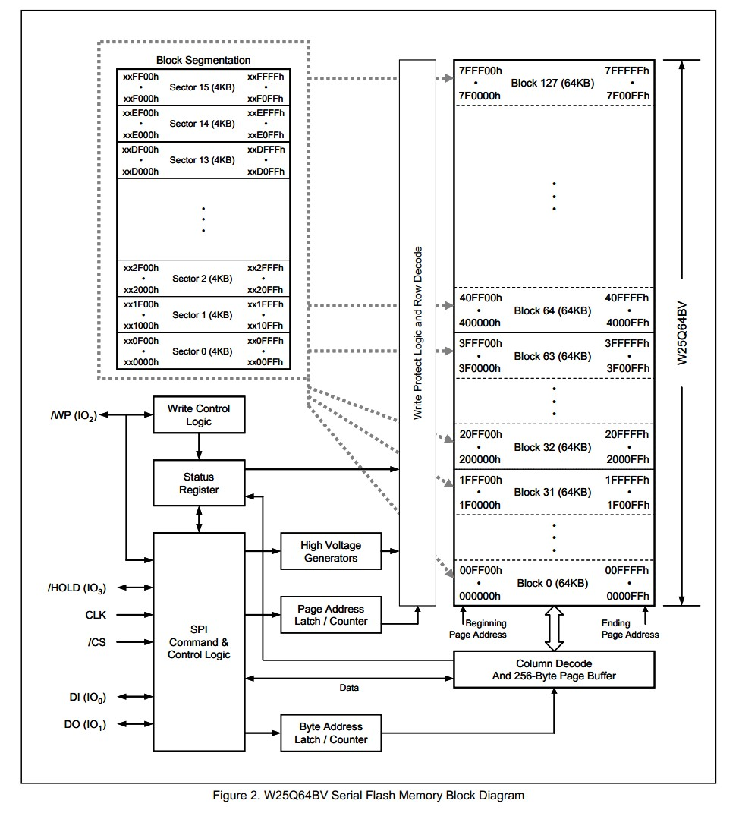
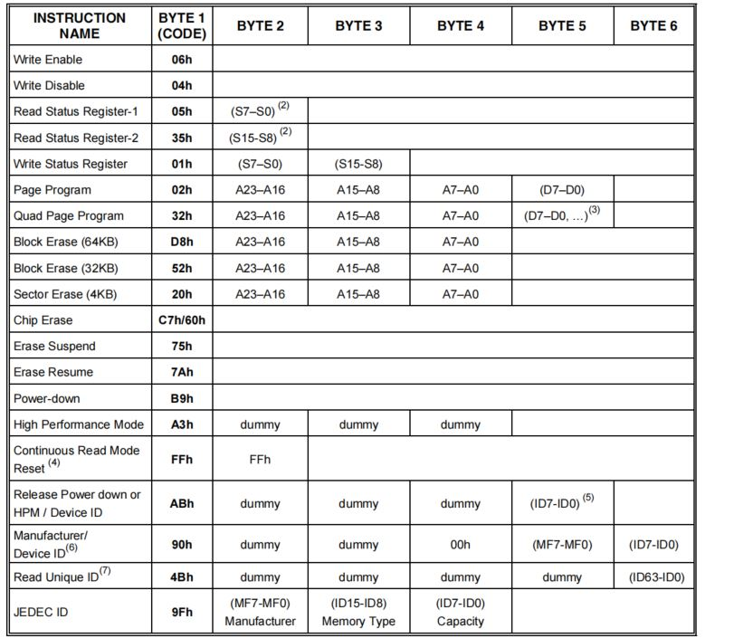
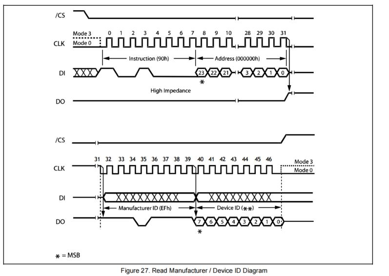
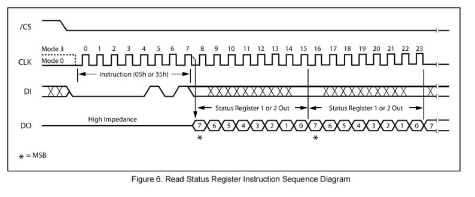
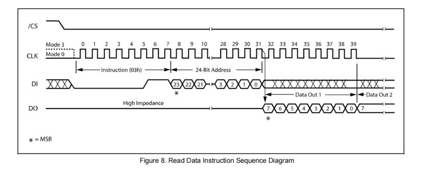
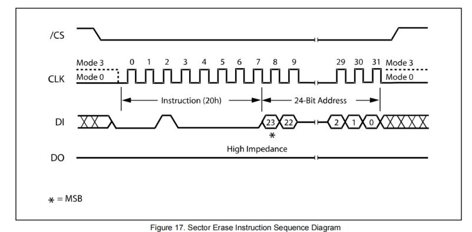

# STM32 HardWare W25Q64

## 1. W25Q64 简介

W25Qxx系列是一种低成本、小型化、使用简单的非易失性存储器，常应用于数据存储、字库存储、固件程序存储等场景。

**存储介质**：Nor Flash（闪存）

**时钟频率**：80MHz / 160MHz (Dual SPI) / 320MHz (Quad SPI)

**通信方式**：SPI/QSPI

**存储容量（24位地址）**：	

| 型号    | 存储容量          |
| ------- | ----------------- |
| W25Q40  | 4Mbit / 512KByte  |
| W25Q80  | 8Mbit / 1MByte    |
| W25Q16  | 16Mbit / 2MByte   |
| W25Q32  | 32Mbit / 4MByte   |
| W25Q64  | 64Mbit / 8MByte   |
| W25Q128 | 128Mbit / 16MByte |
| W25Q256 | 256Mbit / 32MByte |

### 硬件连接

| **引脚**   | **功能**            |
| ---------- | ------------------- |
| VCC、GND   | 电源（2.7~3.6V）    |
| CS（SS）   | SPI片选             |
| CLK（SCK） | SPI时钟             |
| DI（MOSI） | SPI主机输出从机输入 |
| DO（MISO） | SPI主机输入从机输出 |
| WP         | 写保护              |
| HOLD       | 数据保持            |

### W25Q64 框图

## 2. W25Q64 基本指令操作

### ID 的读取（0x90）

> 1. 发送`0x90`；
> 2. 发送3个字节的虚拟数据（`Dummy`，设置为任意数）
> 3. 随后读取两个字节的数据，第一个字节固定为`0xEF`，第二个字节为设备ID号。

注意：

1. **W25QXX仅支持 SPI模式0 和 SPI模式3 **.
2. W25QXX 若读出ID号为`0xFFFF`，请检查接线是否有错。

### 状态寄存器的状态读取（0x05，0x35）

状态寄存器的最后一位为`BUSY`位。

W25QXX有1，2两个状态寄存器，可以指定读取。

> 1. 发送0x05或0x35；
> 2. 发送3个字节的虚拟数据；
> 3. 接受一个字节，即为状态寄存器的状态。

当`BUSY`置为1时，状态寄存器处于忙状态。此时 MCU 发送的命令无效，不能执行。但是可以一直读取状态寄存器状态。

### 读Flash（0x03）

注意，需要等待`BUSY`位置0时方可进行读取。

读取数据可以任意地址（地址长度 32 bit）读任意长度数据（最大 65535 Byte），没有任何限制。

>1. 发送0x03；
>2. 发送24位地址；
>3. 等待`BUSY`位置0后从指定的地址读取指定的字节。

### Flash写使能和写失能（0x06，0x04）

Flash 芯片默认禁止写数据，所以**在向 Flash 写数据之前，必须发送命令开启写使能。**

> 1. 发送`0x06`进行写使能，发送`0x04`进行写失能。

### Flash 扇区擦除（0x20）

> 1. 写入操作前，必须先进行写使能每个数据位只能由1改写为0，不能由0改写为1;
>
> 2. 写入数据前必须先擦除，擦除后，所有数据位变为1;
> 3. 擦除必须按最小擦除单元（扇区）进行;
> 4. 连续写入多字节时，最多写入一页的数据，超过页尾位置的数据，会回到页首覆盖写入;
> 5. 写入操作结束后，芯片进入忙状态，不响应新的读写操作;

### Flash 页写入（0x02）

