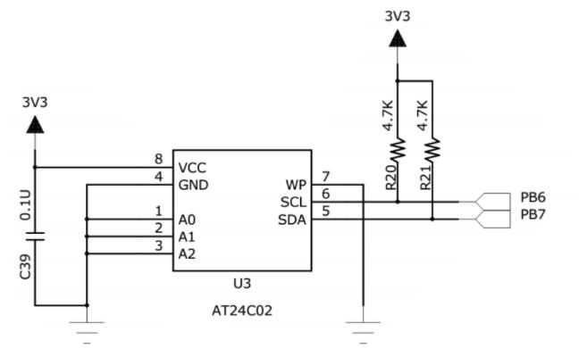
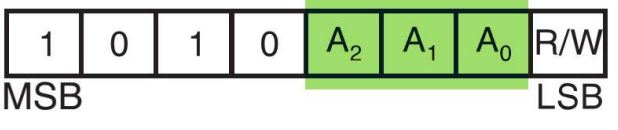

# STM32 HardWare EEPROM

## 1. EEPROM AT24C02

EEPROM 芯片型号：AT24C02。AT24C 系列为美国 ATMEL 公司推出的串行 COMS 型 EEPROM。

芯片型号后两位表示芯片容量，例如 ATC24C02 为 2K。

引脚图中 A0、A1、A2 为器件地址引脚，GND为地，VCC为正电源，WP为写保护，SCL为串行时钟线，SDA为串行数据线。

### 读写地址

AT24Cxx 设备地址**前四位固定为 1010，A2~A0为由管脚电平决定。**

AT24Cxx EEPROM Board模块中默认为接地。A2~A0 为 000，**最后一位 R/W 表示读写操作。**所以由于 I2C 通讯时常常是地址跟读写方向连在一起构成一个 8 位数。

当 R/W 位为 0 时，表示写方向，所以加上 7 位地址，其值为 `0xA0`，常称该值为 I2C 设备的写地址；当 R/W 位为 1 时，表示读方向，加上 7 位地址，其值为 `0xA1`，常称该值为读地址。

### 数据发送

AT24C02 使用 IIC 通信。

AT24C02 型号的芯片页写入时序最多可以一次发送 8 个数据，该值也称为页大小，某些型号的芯片每个页写入时序最多可传输 16 个数据。