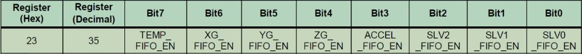
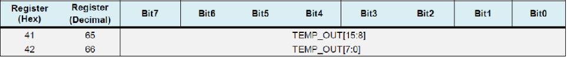
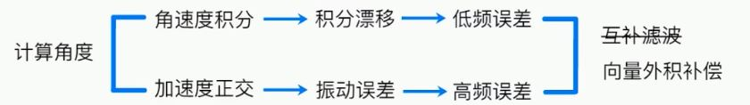
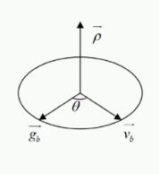
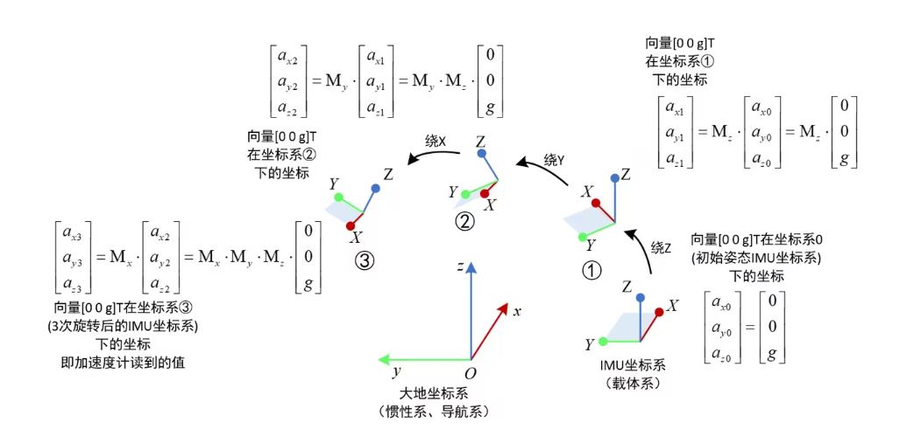
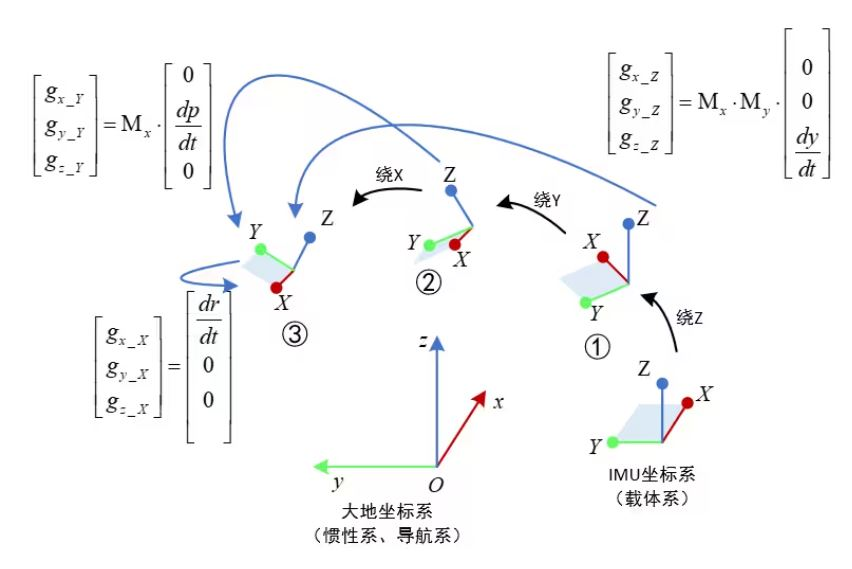

# STM32 HardWare MPU6050/MPU9250

##  1. IMU 数据读取

### MPU6050

MPU6050是InvenSense公司推出的全球首款整合性6轴运动处理组件，内带3轴陀螺仪和3轴加速度传感器，并且含有一个IIC接口，可用于连接外部磁力传感器，利用自带数字运动处理器（DMP: Digital Motion Processor）硬件加速引擎，通过IIC接口，可以向应用端输出完整的9轴姿态融合演算数据。

#### MPU6050 框图


> - `SCL` 和 `SDA` 是连接 MCU 的 IIC 接口，MCU 通过这个 IIC 接口来控制 MPU6050。
> - 另有一个 IIC 接口：`AUX_CL` 和 `AUX_DA`，这个接口可用来连接外部从设备，比如磁力计（MPU6050内部无磁力计，会导致测得的 yaw 轴角度产生漂移），可以组成一个九轴传感器。
> - `VLOGIC` 是 IO 口电压，该引脚最低可以到 1.8V，一般直接接 VDD 即可。
> - `AD0` 是从 IIC 接口（接 MCU）的地址控制引脚，该引脚控制 IIC 地址的最低位。如果接 GND，则 MPU6050 的 IIC 地址是：`0X68`，如果接 VDD，则是`0X69`。

#### MPU6050 寄存器简介

##### 电源管理寄存器(`0x6B`)


> - `DEVICE_RESET` 位用来控制复位，设置为 1，复位 MPU6050，复位结束后，MPU硬件自动清零该位。
> - `SLEEEP` 位用于控制 MPU6050 的工作模式，复位后，该位为 1，即进入了睡眠模式（低功耗），要清零该位以进入正常工作模式。
> - `TEMP_DIS` 用于设置是否使能温度传感器，设置为 0，则使能。
> - `CLKSEL[2:0]`用于选择系统时钟源
>   
>
> 默认使用内部 8M RC ，精度不高，所以一般选择 X/Y/Z 轴陀螺作为参考的 `PLL` 作为时钟源，一般设置 `CLKSEL=001` 即可。

##### 陀螺仪配置寄存器（`0x1B`）


> - `FS_SEL[1:0]`用于设置陀螺仪的满量程范围：0，±250°/S；1，±500°/S；2，±1000°/S；3，±2000°/S；
>
>   一般设置为 3，即 ±2000°/S，陀螺仪的 ADC 为 16 位分辨率，得到灵敏度为：65536/4000=16.4LSB/(°/S)。

##### 加速度传感器配置寄存器（`0X1C`）


> - `AFS_SEL[1:0]`用于设置加速度传感器的满量程范围：0，±2g；1，±4g；2，±8g；3，±16g；一般设置为 0，即±2g，加速度传感器的 ADC 是 16 位，得到灵敏度为：65536/4=16384LSB/g.

##### FIFO 使能寄存器（`0X23`）



该寄存器用于控制 FIFO 使能，在简单读取传感器数据的时候，可以不用 FIFO，设置对应位为 0 即可禁止 FIFO，设置为 1，则使能 FIFO。

##### 陀螺仪采样率分频寄存器（`0X19`）


该寄存器用于设置 MPU6050 的陀螺仪采样频率，计算公式为：
$$
采样频率 = \frac{陀螺仪输出频率}{1+SMPLRT\_DIV}
$$
陀螺仪的输出频率与数字低通滤波器（DLPF）的设置有关，当 `DLPF_CFG=0/7` 的时候，频率为 8Khz，其他情况是 1Khz。 DLPF 滤波频率一般设置为采样率的一半。

采样率假定设置为 50Hz，那么 `SMPLRT_DIV=1000/50-1=19`。                       

##### 配置寄存器（`0X1A`）


用于设置 DLPF 数字低通滤波器：


> 加速度传感器，输出速率（Fs）固定是 1Khz，而角速度传感器的输出速率（Fs），则根据 `DLPF_CFG` 的配置有所不同。
>
> 一般设置角速度传感器的带宽为其采样率的一半，如果设置采样率为 50Hz，则带宽就应该设置为 25Hz，取近似值 20Hz 则设置 `DLPF_CFG=100`。

##### 陀螺仪数据输出寄存器（`0X43`~`0X48`）


##### 加速度传感器数据输出寄存器（`0X3B`~`0X40`）


##### 温度传感器数据输出寄存器（`0X41`~`0X42`）



> 温度换算公式为：
> $$
> Temperature = 36.53 + \frac{regval}{340}
> $$
> 其中，`Temperature`为计算得到的温度值，单位为$℃$，`regval`为从`0X41`和`0X42`读到的温度传感器值。

#### MPU6050 驱动移植

##### DMP 库简介

MPU6050 自带了数字运动处理器，即 DMP，并且，InvenSense 提供了一个 MPU6050 的嵌入式运动驱动库，结合 MPU6050 的 DMP，可以将加速度传感器和角速度传感器的原始数据，直接转换成四元数输出，得到四元数之后就可以很方便的计算出欧拉角：航向角（yaw）、横滚角（roll）和俯仰角（pitch）。

使用 MPU6050 的 DMP 输出的四元数是 q30 格式的，也就是浮点数放大了 2 的 30 次方倍。在换算成欧拉角之前，必须先将其转换为浮点数，也就是除以 2 的 30 次方，然后再进行计算。

```c
        q0=quat[0] / q30; //q30 格式转换为浮点数
        q1=quat[1] / q30;
        q2=quat[2] / q30;
        q3=quat[3] / q30;
        //计算得到俯仰角/横滚角/航向角
        pitch=asin(-2 * q1 * q3 + 2 * q0* q2)* 57.3; //俯仰角
        roll=atan2(2 * q2 * q3 + 2 * q0 * q1, -2 * q1 * q1 - 2 * q2* q2 + 1)* 57.3; //横滚角
        yaw=atan2(2*(q1q2 + q0q3),q0q0+q1q1-q2q2-q3q3) * 57.3; //航向角
```

##### DMP 库移植

[Click Here](https://blog.csdn.net/weixin_51341083/article/details/117475886?ops_request_misc=%7B%22request%5Fid%22%3A%22169754327716800226589059%22%2C%22scm%22%3A%2220140713.130102334..%22%7D&request_id=169754327716800226589059&biz_id=0&utm_medium=distribute.pc_search_result.none-task-blog-2~all~top_positive~default-1-117475886-null-null.142^v96^pc_search_result_base7&utm_term=mpu6050 dmp移植&spm=1018.2226.3001.4187)

###  MPU9250

相对于 MPU6050 而言 MPU9250 增加了磁力计，使得其功能更加强大。

[Click Here](https://blog.csdn.net/qq_17351161/article/details/107669816?ops_request_misc=%7B%22request%5Fid%22%3A%22169754349016800184199329%22%2C%22scm%22%3A%2220140713.130102334.pc%5Fall.%22%7D&request_id=169754349016800184199329&biz_id=0&utm_medium=distribute.pc_search_result.none-task-blog-2~all~first_rank_ecpm_v1~hot_rank-2-107669816-null-null.142^v96^pc_search_result_base7&utm_term=MPU9250&spm=1018.2226.3001.4187)

[Click Here](https://blog.csdn.net/YANGSAI123/article/details/113970800?ops_request_misc=%7B%22request%5Fid%22%3A%22169754749716800222845073%22%2C%22scm%22%3A%2220140713.130102334..%22%7D&request_id=169754749716800222845073&biz_id=0&utm_medium=distribute.pc_search_result.none-task-blog-2~all~sobaiduend~default-1-113970800-null-null.142^v96^pc_search_result_base7&utm_term=inv_enable_fast_nomot&spm=1018.2226.3001.4187)

> 在EIDE链中，应注意静态链接库的链接问题。

## 2. IMU 姿态解算算法

### MPU6050

#### 一阶互补滤波

#### Mahony互补滤波

- 坐标系

地理坐标系（n系）：以东方，北方，上方构成坐标系。

机体坐标系（b系）：以机体为参照物构成的坐标系。

- 使用Euler角描述旋转矩阵

绕z轴旋转$\phi$角（偏航角）：
$$
R_z = \left[
\begin{matrix}
cos\phi & sin\phi & 0 \\
-sin\phi & cos\phi & 0 \\
0 & 0 & 1
\end{matrix}
\right]
$$
绕y轴旋转$\theta$角（俯仰角）：
$$
R_y = \left[
\begin{matrix}
cos\theta & 0 & -sin\theta \\
0 & 1 & 0 \\
sin\theta & 0 & cos\theta
\end{matrix}
\right]
$$
绕x轴旋转$\gamma$角（横滚角）：
$$
R_x = \left[
\begin{matrix}
1 & 0 & 0 \\
0 & cos\gamma & sin\gamma \\
0 & -sin\gamma & cos\gamma
\end{matrix}
\right]
$$
从机体坐标系到地理坐标系的矩阵为姿态矩阵：
$$
R^n_b = R_z^TR_y^TR_x^T = 
\left[
\begin{matrix}
cos\theta cos\phi & sin\gamma sin\theta cos\phi - cos\gamma sin\phi & cos\gamma sin\theta cos\phi + sin\gamma sin\phi \\
cos\theta sin\phi & sin\gamma sin\theta sin \phi + cos\gamma cos\phi & cos\gamma sin\theta cos\phi  sin\gamma cos\phi \\
-sin\theta & sin\gamma cos\theta & cos\gamma cos\theta
\end{matrix}
\right]
$$
由姿态矩阵可以求解出载体的横滚角$\gamma$、俯仰角$\theta$和航向角$\phi$的主值。

欧拉角描述的方向余弦矩阵伴随着大量的三角运算，对单片机的处理不友好，会影响解算速度，而且会出现一个欧拉角死锁问题。

- 四元数描述旋转矩阵

四元数$q_0 + q_1\bold{i} + q_2\bold{j} + q_3\bold{k}$描述的旋转矩阵如下：
$$
R^n_b = \left[
\begin{matrix}
q_0^2 + q_1^2 - q_2^2 - q_3^2 & 2(q_1q_2 - q_0q_3) & 2(q_1q_3 + q_0q_2) \\
2(q_1q_2 + q_0q_3) & q_0^2 - q_1^2 + q_2^2 - q_3^2 & 2(q_2q_3 - q_0q_1) \\
2(q_1q_3 - q_0q_2) & 2(q_0q_3 + q_0q_1) & q_0^2 - q_1^2 -q_2^2 + q_3^2
\end{matrix}
\right]
$$
与Euler角表示的旋转矩阵相对应，可以得出Euler角的表达式：
$$
\gamma = arctan\frac{2(q_2q_3 + q_0q_1)}{q_0^2 - q_1^2 - q_2^2 + q_3^2} \\
\theta = -arcsin(2(q_1q_3 - q_0q_2)) \\
\phi = arctan\frac{2(q_1q_2 + q_0q_3)}{q_0^2 + q_1^2 - q_2^2 - q_3^2}
$$

- 通过传感器数据求解四元数

需要构建四元数关于时间的微分方程以求得$Q$和$\omega$之间的数学关系。

假设在$t$时刻姿态为四元数$q(t)$，在$\Delta t$后机体产生了微小旋转，定义旋转角速度向量为$\bold{\omega}$，先对其进行单位化：
$$
\hat{\bold{\omega}} = \frac{\bold{\omega}}{||\bold{\omega}||}
$$
转过的角度为：
$$
\Delta \theta = ||\bold{\omega}||\Delta t
$$
则由四元数的三角表示式，有：
$$
\Delta q = cos\frac{\Delta \theta}{2} + sin\frac{\Delta \theta}{2}\hat{\bold{\omega}}
$$
则旋转后的四元数：
$$
q(t+\Delta t) - q(t) = -2sin^2\frac{||\bold{\omega}||}{2}\Delta t q(t) + \hat{\bold{\omega}}sin\frac{||\bold{\omega}||}{2}\Delta t q(t)
$$
舍去高阶项，可得：
$$
\frac{d q(t)}{dt} = \frac{1}{2}\bold{\omega}q(t)
$$
实际上获得的是机体上测的的角速度：
$$
\bold{\omega} = q(t) \bold{\omega}^b q^{-1}(t)
$$
即得到：
$$
\left[
\begin{matrix}
\dot{q_0} \\
\dot{q_1} \\
\dot{q_2} \\
\dot{q_3}
\end{matrix}
\right] = 
\frac{1}{2}
\left[
\begin{matrix}
0 & -\omega^b_x & -\omega^b_y & -\omega^b_z \\
\omega^b_x & 0 & \omega^b_z & -\omega^b_y \\
\omega^b_y & -\omega^b_z & 0 & \omega^b_x\\
\omega^b_z & \omega^b_y & -\omega^b_x & 0
\end{matrix}
\right]
\left[
\begin{matrix}
q_0 \\
q_1 \\
q_2 \\
q_3
\end{matrix}
\right]
$$
使用一阶龙格库塔法解该微分方程组，得到：
$$
q(t + \Delta t) = q(t) + \frac{1}{2} 
\left[
\begin{matrix}
-\omega^b_xq_1-\omega^b_yq_2-\omega^b_zq_3 \\
\omega^b_xq_0-\omega^b_yq_3+\omega^b_xq_2 \\
\omega^b_xq_3+\omega^b_yq_0-\omega^b_zq_1 \\
-\omega^b_xq_2+\omega^b_yq_1+\omega^b_zq_0
\end{matrix}
\right]\Delta t
$$

- 传感器数据融合

在一阶互补滤波中，使用一阶数字LPF和HPF进行滤波，Mahony算法中，使用向量外积法进行补偿。



将测量重力加速度进行坐标转换：
$$
\bold{g}_b = R^n_b \bold{g}_n
$$
推导出的四元数可以得出当前理论重力加速度分量，将其与实际重力加速度分量相比较，即可校正四元数。

通过叉积反映该误差：



将加速度向量单位化后，误差仅和夹角有关。

- PI控制器补偿

使用PI控制器将补偿引回，$K_p$越大，越相信加速度计，$K_p$越小，越相信陀螺仪。

```c
    short accx, accy, accz;
    short gyrox, gyroy, gyroz;
    MPU_Get_Accelerometer(&accx, &accy, &accz);
    MPU_Get_Gyroscope(&gyrox, &gyroy, &gyroz);

    // 单位转换
    float ax, ay, az, gx, gy, gz, norm;
    imu_data.gyro_x  = gyrox * k_g;
    imu_data.gyro_y  = gyroy * k_g;
    imu_data.gyro_z  = gyroz * k_g;
    imu_data.accel_x = accx * k_a;
    imu_data.accel_y = accy * k_a;
    imu_data.accel_z = accz * k_a;

    // 单位化
    norm = sqrt(imu_data.accel_x * imu_data.accel_x + imu_data.accel_y * imu_data.accel_y + imu_data.accel_z * imu_data.accel_z);
    ax   = imu_data.accel_x / norm;
    ay   = imu_data.accel_y / norm;
    az   = imu_data.accel_z / norm;

    // 重力估计
    float g_vx, g_vy, g_vz;
    g_vx = 2 * (imu_data.q1 * imu_data.q3 - imu_data.q0 * imu_data.q2);
    g_vy = 2 * (imu_data.q0 * imu_data.q1 - imu_data.q2 * imu_data.q3);
    g_vz = imu_data.q0 * imu_data.q0 - imu_data.q1 * imu_data.q1 - imu_data.q2 * imu_data.q2 + imu_data.q3 * imu_data.q3;

    // 叉积求得误差
    float ex, ey, ez;
    ex = (ay * g_vz - az * g_vy);
    ey = (az * g_vx - ax * g_vz);
    ez = (ax * g_vy - ay * g_vx);

    // 积分误差比例积分增益
    imu_data.exInt = imu_data.exInt + ex * Ki;
    imu_data.eyInt = imu_data.eyInt + ey * Ki;
    imu_data.ezInt = imu_data.ezInt + ez * Ki;

    // 调整后的陀螺仪测量
    gx = imu_data.gyro_x + Kp * ex + imu_data.exInt;
    gy = imu_data.gyro_y + Kp * ey + imu_data.eyInt;
    gz = imu_data.gyro_z + Kp * ez + imu_data.ezInt;

    // 整合四元数率和正常化
    imu_data.q0 = imu_data.q0 + (-imu_data.q1 * gx - imu_data.q2 * gy - imu_data.q3 * gz) * halfT;
    imu_data.q1 = imu_data.q1 + (imu_data.q0 * gx + imu_data.q2 * gz - imu_data.q3 * gy) * halfT;
    imu_data.q2 = imu_data.q2 + (imu_data.q0 * gy - imu_data.q1 * gz + imu_data.q3 * gx) * halfT;
    imu_data.q3 = imu_data.q3 + (imu_data.q0 * gz + imu_data.q1 * gy - imu_data.q2 * gx) * halfT;

    // 正常化四元数
    norm        = sqrt(imu_data.q0 * imu_data.q0 + imu_data.q1 * imu_data.q1 + imu_data.q2 * imu_data.q2 + imu_data.q3 * imu_data.q3);
    imu_data.q0 = imu_data.q0 / norm;
    imu_data.q1 = imu_data.q1 / norm;
    imu_data.q2 = imu_data.q2 / norm;
    imu_data.q3 = imu_data.q3 / norm;

    // 求欧拉角
    imu_data.pitch      = asin(-2 * imu_data.q1 * imu_data.q3 + 2 * imu_data.q0 * imu_data.q2) * 57.3;
    imu_data.roll       = atan2(2 * imu_data.q2 * imu_data.q3 + 2 * imu_data.q0 * imu_data.q1, -2 * imu_data.q1 * imu_data.q1 - 2 * imu_data.q2 * imu_data.q2 + 1) * 57.3;
    imu_data.yaw        = atan2(2 * (imu_data.q1 * imu_data.q2 + imu_data.q0 * imu_data.q3), imu_data.q0 * imu_data.q0 + imu_data.q1 * imu_data.q1 - imu_data.q2 * imu_data.q2 - imu_data.q3 * imu_data.q3) * 57.3;
    imu_data.tempreture = (float)MPU_Get_Temperature();
```

#### Kalman滤波

- 使用加速度计进行姿态解算

当加速度计水平放置，即Z轴竖直向上时，Z轴可以读到$1g$的数值（$g$为重力加速度），X轴和Y轴两个方向读到0，可以记作$(0，0，g)$。

当加速度计旋转一定的姿态时，重力加速度会在加速度的3个轴上产生相应的分量，其本质是大地坐标系下的$(0，0，g)$在新的加速度计自身坐标系下的坐标，加速度计读到的3个值就是$(0，0，g)$向量的新坐标。
$$
\left[
\begin{matrix}
a_x \\
a_y \\
a_z
\end{matrix}
\right]
= 
\left[
\begin{matrix}
-sin\theta \\
cos\theta sin\gamma \\
cos\theta cos\gamma
\end{matrix}
\right]g
$$
可得俯仰角和横滚角，但无法得到偏航角：
$$
\gamma = arctan\frac{a_y}{a_z} \\
\theta = -arctan\frac{a_x}{\sqrt{a_y^2+a_z^2}}
$$


加速度计易受到高频噪声影响。

- 陀螺仪解算姿态角

对角速度积分，可以得到角度。 


$$
\left[
\begin{matrix}
\dot{\gamma} \\
\dot{\theta} \\
\dot{\phi}
\end{matrix}
\right]
= 
\left[
\begin{matrix}
1 & \frac{sin\theta sin\gamma}{cos\theta} & \frac{cos\gamma sin{\theta}}{cos\theta} \\
0 & cos\gamma & -sin\gamma \\
0 & \frac{sin\gamma}{cos\theta} & \frac{cos\gamma}{cos{\theta}}
\end{matrix}
\right]
\left[
\begin{matrix}
\omega_x^b \\
\omega_y^b \\
\omega_z^b
\end{matrix}
\right]
$$
陀螺仪存在低频的漂移，属于低频噪声。

- 使用Kalman Filter进行数据融合

定义俯仰角$\theta$，横滚角$\gamma$为状态变量。

1. 首先得到状态方程，获得先验估计量：

$$
\left[
\begin{matrix}
\gamma _{k-} \\
\theta _{k-}
\end{matrix}
\right]
= 
\left[
\begin{matrix}
1 & 0 \\
0 & 1
\end{matrix}
\right]
\left[
\begin{matrix}
\gamma_{k-1} \\
\theta_{k-1}
\end{matrix}
\right]
+
\left[
\begin{matrix}
\Delta t & 0 \\
0 & \Delta t
\end{matrix}
\right]
\left[
\begin{matrix}
\omega_x \\
\omega_y
\end{matrix}
\right]
$$

其中$\omega_x，\omega_y$由$\gamma_{k-1}$和$\theta_{k-1}$计算得到。

记当前测量值$\bold{z_k}$为加速度计测量值，则$\hat{\bold{x_{MEA(k)}}} = \bold{H}^{-1}\bold{z_k}$

，令
$$
\bold{H} = \left[
\begin{matrix}
1 & 0 \\
0 & 1
\end{matrix}
\right]
$$

2. 进行误差更新：

$$
\begin{aligned}
\bold{P_k^-}  
&=\bold{ AP_{k-1}A^T + Q}
\end{aligned}
$$

$\bold{Q}$（过程噪声矩阵）和$\bold{P_0}$（误差协方差矩阵）由用户确定。

由于
$$
\bold{A} = \left[
\begin{matrix}
1 & 0 \\
0 & 1
\end{matrix}
\right]
$$
则：
$$
\begin{aligned}
\bold{P_k^-}  
&=\bold{ P_{k-1} + Q}
\end{aligned}
$$

3. 计算卡尔曼增益：

$$
\bold{K_k} = \frac{\bold{P_k^-}}{\bold{P_k^-  + R}} 
$$

$\bold{R}$（观测噪声协方差矩阵）由用户确定。

4. 数据融合：

$$
\bold{\hat{x_k}} = \hat{\bold{x_{k}^{-}}} + \bold{K_k}(\bold{z_k} - \hat{\bold{x_{k}^{-}}}) 
$$

5. 校正：

$$
\begin{aligned}
\bold{P_k}
&= (\bold{I} - \bold{K_k})\bold{P_k^-}
\end{aligned}
$$

