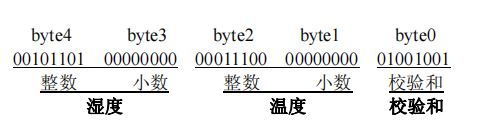
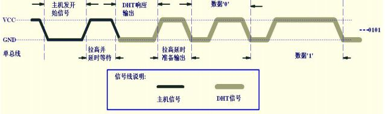
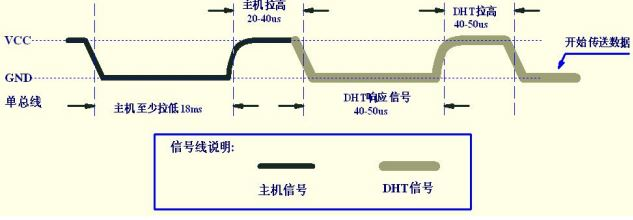
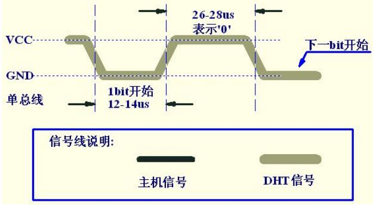
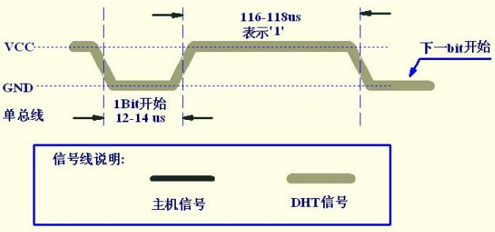

# STM32 HardWare 5_DHT_11

DHT11 是广州奥松有限公司生产的一款湿温度一体化的数字传感器。该传感器包括一个电阻式测湿元件和一个 NTC 测温元件，并与一个高性能 8 位单片机相连接。通过单片机等微处理器简单的电路连接就能够实时的采集本地湿度和温度。

DHT11 与单片机之间能采用简单的单总线进行通信（DATA引脚），仅仅需要一个I/O 口。传感器内部湿度和温度数据 40Bit 的数据一次性传给单片机，**数据采用校验和方式进行校验**，有效的保证数据传输的准确性。

DHT11 功耗很低，5V 电源电压下，工作平均最大电流 0.5mA。

## 1. 数据结构

DHT11数字湿温度传感器采用单总线数据格式。即，单个数据引脚端口完成输
入输出双向传输。其数据包由5Byte（40Bit）组成。

一次完整的数据传输为40bit，高位先出。

数据格式：
$$
8bit湿度整数数据+8bit湿度小数数据
+8bit温度整数数据+8bit温度小数数据
+8bit校验和
$$
**校验和数据为前四个字节相加**



DHT11一次通讯时间最大3ms，主机连续采样间隔建议不小于100ms。

## 2. 传输时序

### 开始发送数据



主机发送开始信号后,延时等待 20us-40us 后读取 DHT11 的回应信号，读取总线为低电平,说明 DHT11 发送响应信号，DHT11 发送响应信号后，再把总线拉高,准备发送数据,每一 bit 数据都以低电平开始,格式见下面图示。如果读取响应信号为高电平,则 DHT11 没有响应,请检查线路是否连接正常。

### 主机复位信号和 DHT11 响应信号



```c
    DHT11_ModeSet(0);      //GPIO输出模式
    DHT11_L;                
    delay_ms(18);           //开始信号发送（拉低18ms）
    DHT11_H;
    delay_us(20);           //开始信号结束（拉高20us）

    DHT11_ModeSet(1);      //GPIO输入模式
    delay_us(20);           //间隔20us后读取DHT11响应信号
    if(DHT11_Read == 0)
    {
        while(DHT11_Read == 0 && delay < 100)       //如果在100us内读取到响应信号，继续
        {
            delay_us(1);
            delay++;
        }
        delay = 0;
        while(DHT11_Read == 1 && delay < 100)       //如果在100us内读取到字节接收初始信号，继续
        {
            delay_us(1);
            delay++;            
        }
        delay = 0;
        for(int i = 0;i < 5;i++)                    //接收5个8 bit数据
        {
            DHT11_Data[i] = DHT11_Read_Byte();
        }
        delay_us(50);
    }
```

### 0表示方法



### 1表示方法



```c
    for(int i = 0;i < 8;i++)
    {
        while (DHT11_Read == 0 && delay < 100)  //在100us内读取到1 bit数据开始发送的低电平信号，继续
        {
            delay_us(1);
            delay++;
        }
        delay = 0;
        delay_us(40);                           //延时40us用以区分0，1
        if(DHT11_Read == 1)
        {
            temp = 1;
        }
        else
        {
            temp = 0;
        }
        while(DHT11_Read == 1 && delay < 100)   //二次读取防止出错
        {
            delay_us(1);
            delay++;
        }
        delay = 0;
        ret <<= 1;                              //结果进行左移位
        ret |= temp;                            //进行或运算得到当前数据
    }
```