# STM32 Hardware TFTLCD

## 1. TFTLCD 简介

### LCD 显示原理

| 显示器 | 举例                   | 优点                           | 缺点                 |
| ------ | ---------------------- | ------------------------------ | -------------------- |
| 断码屏 | 数码管、计算器、遥控器 | 成本低，驱动简单，稳定         | 色彩单一，显示内容少 |
| 点阵屏 | 户外广告屏             | 任意尺寸，亮度高               | 贵，耗电，体积大     |
| LCD屏  | 显示器、电视屏、手机屏 | 成本低，色彩好，薄，寿命长     | 全彩稍差，漏光，拖影 |
| OLED屏 | 显示器、电视屏、手机屏 | 自发光，色彩最好，超薄，功耗低 | 比较贵，寿命短       |

- LCD 简介

LCD（Liquid Crystal Display，即液晶显示器），由玻璃基板、背光、驱动IC等组成，全彩LCD，是一种全彩显示屏（RGB565、RGB888），可以显示各种颜色。

LCD 常用的接口如下：

| 接口 | 分辨率     | 特性                                               |
| ---- | ---------- | -------------------------------------------------- |
| MCU  | ≤ 800×480  | 带SRAM，无需频繁刷新，无需大内存，驱动简单         |
| RGB  | ≤ 1280×800 | 不带SRAM，需要实时刷新，需要大内存，驱动稍微复杂   |
| MIPI | 4K         | 不带SRAM，支持分辨率高，省电，大部分手机屏用此接口 |

MCU屏接口由于自带SRAM，驱动简单，大部分单片机都能驱动。

- LCD 显示原理

无法通过其他颜色混合得到的颜色，称之为基本色。通过三基色混合，可以得到自然界中绝大部分颜色。

> - 电脑一般用32位来表示一个颜色（ARGB888）
>
> 
>
> - 单片机一般用16/24位表示一个颜色（RGB565/RGB888）
>
> 
>
> 

### LCD 驱动原理

> 1. LCD 驱动 IC 使用 8080 时序驱动；
> 2. LCD 的初始化序列由厂商提供；
> 3. 实现画点函数，读点函数即可实现绘图功能。

#### 8080 时序

8080 时序为并口总线时序，常用于MCU屏驱动IC的访问，由Intel提出，也叫英特尔总线。

| 信号      | 名称      | 控制状态      | 作用                                   |
| --------- | --------- | ------------- | -------------------------------------- |
| `CS`      | 片选      | 低电平        | 选中器件，低电平有效，先选中，后操作   |
| `WR`      | 写        | ↑             | 写信号，上升沿有效，用于数据/命令写入  |
| `RD`      | 读        | ↑             | 读信号，上升沿有效，用于数据/命令读取  |
| `RS`      | 数据/命令 | 0:命令/1:数据 | 表示当前是读写数据还是命令，也叫DC信号 |
| `D[15:0]` | 数据线    | 无            | 双向数据线，可以写入/读取驱动IC数据    |

- 8080 写时序

数据（RS=1）/命令（RS=0），在WR的上升沿，写入LCD驱动IC，RD保持高电平。

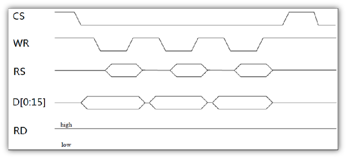

```c
void lcd_write_data(uint16_t data)
{
    	LCD_RS(1);			/* 操作数据 */
    	LCD_CS(0);			/* 选中 */
    	LCD_DATA_OUT(data);	/* 数据 */
    	LCD_WR(0);			/* WR低电平 */
    	LCD_WR(1);			/* WR高电平 */
    	LCD_CS(1);			/* 释放片选 */
}
```

- 8080 读时序

数据（RS=1）/命令（RS=0），在RD的上升沿，读取到MCU，WR保持高电平。

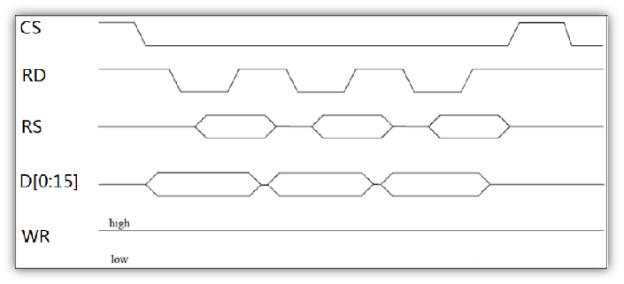

```c
uint16_t  lcd_read_data(void)
{
		uint16_t ram;  		/* 定义变量 */
 		LCD_RS(1);           /* 操作数据 */
    	LCD_CS(0);			/* 选中 */
    	LCD_RD(0);			/* RD低电平 */
   		ram = LCD_DATA_IN;   /* 读取数据 */
    	LCD_RD(1);			/* RD高电平 */
    	LCD_CS(1);			/* 释放片选 */
		return ram；			/* 返回读数 */
}
```

#### LCD 指令集（ILI9341）

| 指令(HEX) | 名称     | 作用                              |
| --------- | -------- | --------------------------------- |
| `0xD3`    | 读ID     | 用于读取LCD控制器的ID，区分型号用 |
| `0x36`    | 访问控制 | 设置GRAM读写方向，控制显示方向    |
| `0x2A`    | 列地址   | 一般用于设置X坐标                 |
| `0x2B`    | 页地址   | 一般用于设置Y坐标                 |
| `0x2C`    | 写GRAM   | 用于往LCD写GRAM数据               |
| `0x2E`    | 读GRAM   | 用于读取LCD的GRAM数据             |

- 读取ID指令`0xD3`

读取LCD控制器型号，通过型号可以执行不同LCD初始化，以兼容不同LCD。

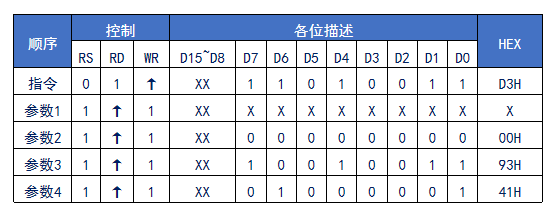

- 访问控制指令`0x36`

实现GRAM读写方向控制，即：控制GRAM自增方向，从而控制显示方向。

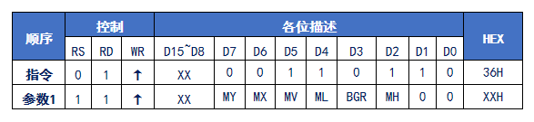

> - `MX`,`MY`,`MV`：共同控制GRAM自增方向（扫描方向）
> - `BGR`：可以控制RGB、BGR顺序

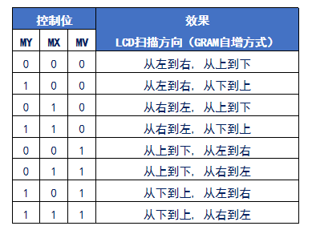

- X坐标设置指令`0x2A`

列地址设置指令，一般用于设置X坐标。

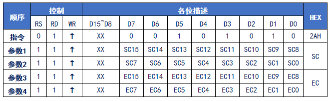

> - `SC`：起始坐标
> - `EC`：结束坐标

- Y坐标设置指令`0x2B`

页地址设置指令，一般用于设置Y坐标。

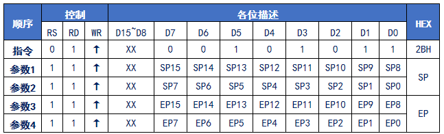

> - `SP`：起始坐标
> - `EP`：结束坐标

- 写GRAM指令`0x2C`

发送该指令后，数据线变成16位，可以开始写入GRAM数据，支持地址自增。

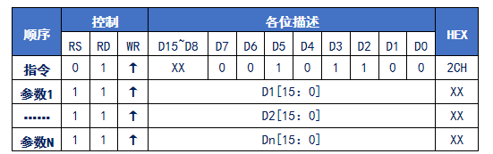

> 每次写入1个像素点的颜色值（`RGB565`），地址自增方向由`MX`/`MY`/`MV`控制无需重新设置坐标，可实现连续写入，大大提高写入速度。

- 读GRAM指令`0X2E`

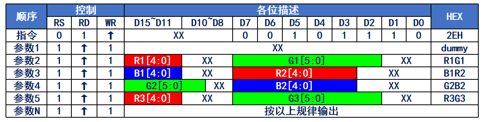

## 2. FSMC 接口

### FSMC 简介

FSMC（Flexible Static Memory Controller，灵活的静态存储控制器），用于驱动 SRAM，NOR FLASH，NAND FLASH 及PC卡类型的存储器。**配置好FSMC，定义一个指向这些地址的指针，通过对指针操作就可以直接修改存储单元的内容，FSMC自动完成读写命令和数据访问操作，不需要程序去实现时序。**

由于 TFTLCD 自带 SRAM，故配置 FSMC 即可实现驱动时序。

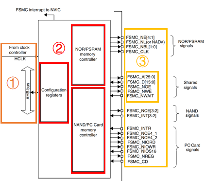

> 1. 时钟控制逻辑FSMC挂载在AHB总线上时钟信号来自HCLK；
> 2. STM32内部的FSMC控制单元：NOR闪存和PSRAM控制器，NAND闪存和PC卡控制器，FSMC配置寄存器。
> 3. 通信引脚：不同类型存储器用到的信号引脚和公共信号引脚。

对于 TFTLCD 而言，使用以下引脚用于模拟 8080 时序：

| FSMC信号       | 信号方向  | 功能                                  |
| -------------- | --------- | ------------------------------------- |
| `FSMC_NE[x]`   | 输出      | 片选引脚，x=1…4，每个对应不同的内存块 |
| `FSMC_A[25:0]` | 输出      | 地址总线                              |
| `FSMC_D[15:0]` | 输出/输入 | 双向数据总线                          |
| `FSMC_NOE`     | 输出      | 输出使能（“N”表明低电平有效信号）     |
| `FSMC_NWE`     | 输出      | 写使能                                |

（使用SRAM控制方法）

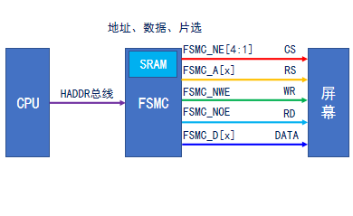

> 使用地址线确定命令/数据。

### FSMC 时序

FSMC 可以产生多种时序来控制外部存储器。对于NOR/PSRAM控制器，产生的异步时序就有5种，总体分为两类：一类是模式1，其他为拓展模式。	

拓展模式相对模式1来说读写时序时间参数设置可以不同，满足存储器读写时序不一样需求。

| 访问模式 | 对应的外部存储器     | 时序特性                                                     |
| -------- | -------------------- | ------------------------------------------------------------ |
| 模式1    | SRAM/CRAM            | OE在读时序片选过程不翻转，有NBL信号，无NADV信号              |
| 模式A    | SRAM/PSRAM(CRAM)     | OE在读时序片选过程翻转，有NBL信号，无NADV信号                |
| 模式B/2  | NOR FLASH            | OE在读时序片选过程不翻转，无NBL信号，有NADV信号              |
| 模式C    | NOR FLASH            | OE在读时序片选过程翻转，无NBL信号，有NADV信号                |
| 模式D    | 带地址扩展的异步操作 | OE在读时序片选过程翻转，无NBL信号，有NADV信号，存在地址保存时间 |

通常的，对于 TFTLCD ，采用模式A进行控制。

- FSMC 时序和 8080 时序对照

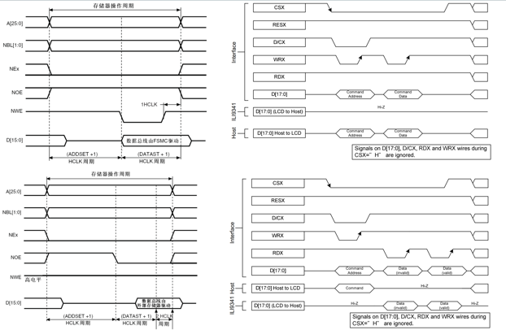

> `ADDSET`和`DATASET`需要进行配置以满足 8080 时序的要求。
>
> 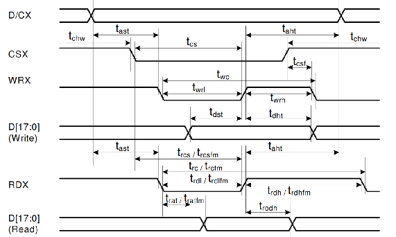
>
> 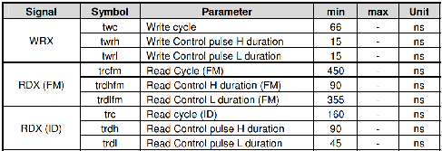
>
> 需要符合：读ID低电平脉宽(`trdl`)，读ID高电平脉宽(`trdh`)，读FM低电平脉宽(`trdlfm`)，读FM高电平脉宽(`trdhfm`)，写控制低电平脉宽(`twrl`)，写控制高电平脉宽(`twrh`)。
>
> FSMC时序中`ADDSET`和`DATAST`不需要严格要求，可以使用实践值。

### FSMC 地址映射

使用FSMC外接存储器，其存储单元是映射到STM32的内部寻址空间的。从FSMC角度看，可以把外部存储器划分为固定大小为256M字节的四个存储块。


对于 TFTLCD ，使用FSMC存储器接口的块1即可。存储块1被分为4个区，每个区管理64M字节空间。

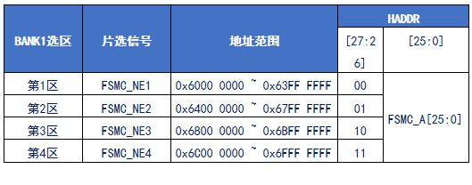

- HADDR 总线

HADDR总线是转换到外部存储器的内部AHB地址线。HADDR是字节地址，而存储器访问不都是按字节访问，接到存储器的地址线与其数据宽度相关。

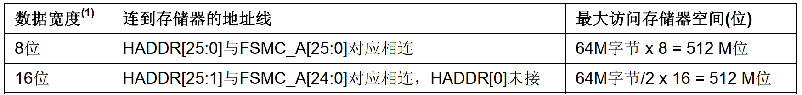

由于 TFTLCD 使用16根数据线， 故数据宽度为16位，存在地址偏移。

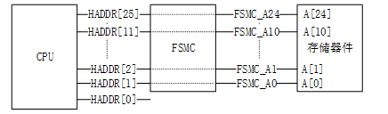

- 使用 FSMC_A[x] 替换 TFTLCD 的某一根 RS 信号线，从而需要确定发送的两个地址。

> 确定存储基地址 -> 确定地址线地址（注意地址偏移）-> 确定读写地址

### FSMC 寄存器

| 寄存器      | 名称           | 作用                                        |
| ----------- | -------------- | ------------------------------------------- |
| `FSMC_BCR`  | 片选控制寄存器 | 包含存储器块的信息（存储器类型/数据宽度等） |
| `FSMC_BTR`  | 片选时序寄存器 | 设置读操作时序参数（`ADDSET`/`DATAST`）     |
| `FSMC_BWTR` | 写时序寄存器   | 设置写操作时序参数（`ADDSET`/`DATAST`）     |

#### SRAM/NOR闪存片选控制寄存器`FSMC_BCRx`

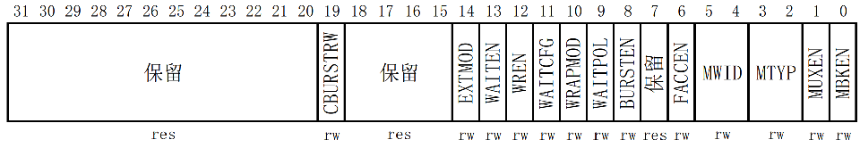

> - `EXTMOD`：扩展模式使能位，控制是否允许读写不同的时序。
> - `WREN`：写使能位。
> - `MWID[1:0]`：存储器数据总线宽度。00，表示8位数据模式；01表示16位数据模式；10和11保留。
> - `MTYP[1:0]`：存储器类型。00表示SRAM、ROM；01表示PSRAM；10表示NOR FLASH；11保留。MBKEN：存储块使能位。

#### SRAM/NOR闪存片选时序寄存器`FSMC_BTRx`


> - `ACCMOD[1:0]`：访问模式。00：模式A；01：模式B；10：模式C；11：模式D。
> - `DATAST[7:0]`：数据保持时间，等于`DATAST(+1)`个HCLK时钟周期，`DATAST`最大为255。
> - `ADDSET[3:0]`：地址建立时间。表示`ADDSET(+1)`个HCLK时钟周期，`ADDSET`最大为15。

#### SRAM/NOR闪存写时序寄存器`FSMC_BWTRx`

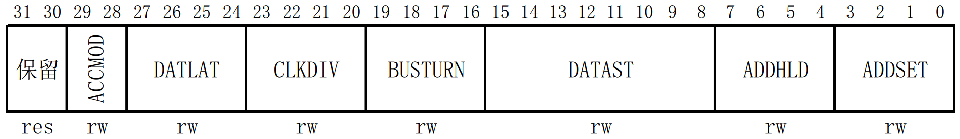

> - `ACCMOD[1:0]`：访问模式。00：模式A；01：模式B；10：模式C；11：模式D。
> - `DATAST[7:0]`：数据保持时间，等于`DATAST(+1)`个HCLK时钟周期，`DATAST`最大为255。
> - `ADDSET[3:0]`：地址建立时间。表示`ADDSET(+1)`个HCLK时钟周期，`ADDSET`最大为15。

### STM32CubeMX 参考配置

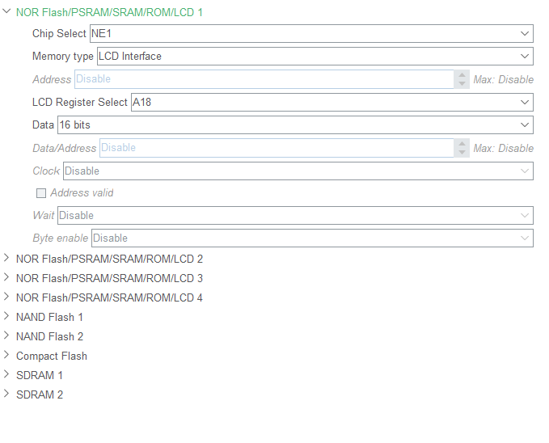

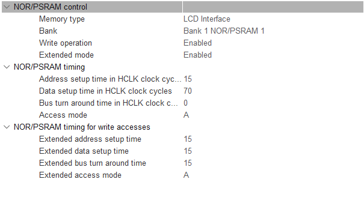