# STM32 Hardware RGBLCD

## 1. RGBLCD 简介

### 接口简介

RGBLCD 是 TFTLCD 的一种，但是引出的是 RGB 接口而非 MCU 接口。RGB 数据线为24根颜色数据线（RGB各占8根即RGB888，1600W色）。

| **裸屏信号线** | **信号说明**          |
| -------------- | --------------------- |
| `R [0 : 7]`    | 红色数据线，一般为8位 |
| `G [0 : 7]`    | 绿色数据线，一般为8位 |
| `B [0 : 7]`    | 蓝色数据线，一般为8位 |
| `DE`           | 数据使能线            |
| `VSYNC`        | 垂直同步信号线        |
| `HSYNC`        | 水平同步信号线        |
| `DCLK`         | 像素时钟信号线        |

### 驱动模式（刷新方式）

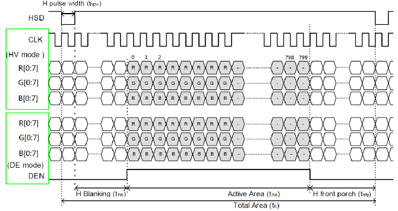

1. **DE同步模式**：使用DE信号来确定有效数据；
2. **HV同步模式**：需要行和场同步信号来表示扫描的行和列。
> 1. 水平扫描时序
> - $t_{hpw}$：水平同步有效信号脉宽，用于表示一行数据的开始；
> - $t_{hb}$：水平后廊，表示从水平有效信号开始，到有效数据输出之间的像素时钟个数；
> - $t_{hfp}$：水平前廊，表示一行数据结束后，到下一个水平同步信号开始之前的像素时钟个数。
>
> 2. 垂直扫描时序
>
> 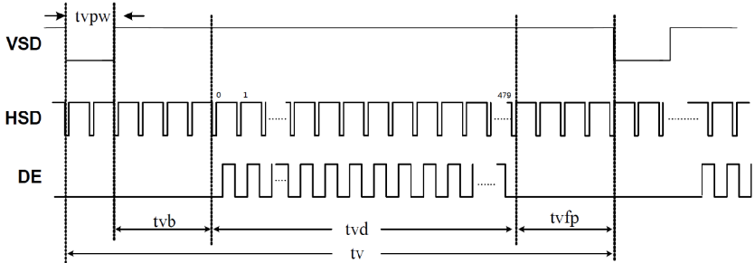
>
> - $t_{vpw}$：垂直同步有效信号脉宽，用于表示一帧数据的开始；
> - $t_{vb}$：垂直后廊，表示垂直同步信号以后的无效行数；
> - $t_{vfp}$：垂直前廊，表示一帧数据输出结束后，到下一个垂直同步信号开始之前的无效行数。
>
> 3. RGBLCD 时序参数
>
> 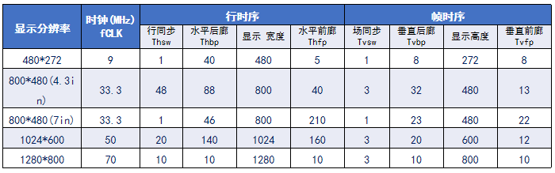

## 2. STM32 LTDC简介

### LTDC 框图

LTDC，为 LCD-TFT 显示控制器。通过 LTDC 外设，可使芯片直接外接 RGBLCD 屏，实现液晶屏驱动。

> 1. 与其他接口相比，LTDC可连接低成本显示模块；
> 2. 可以驱动16位、18位和24位显示模块；
> 3. 分辨率范围(宽度4096,高度2048)，像素时钟高达83MHz；
> 4. 支持RGB888、RGB565、ARGB8888和ARGB1555（A表示透明像素）；
> 5. LTDC硬件完全能够管理数据读取、RGB输出和信号控制；
> 6. 2层数据源:前景层和背景层，LTDC混合后输出到LCD有一层数据。

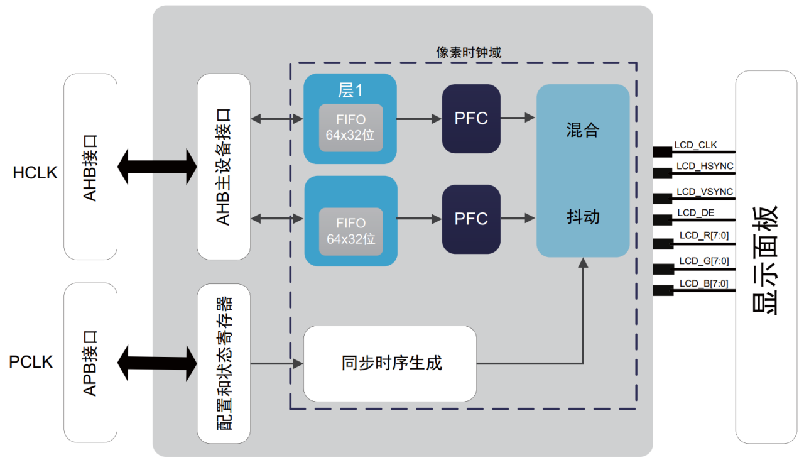

1. 像素处理单元（像素时钟域内）

LTDC有两层，每层都可以分别启用、禁用和配置。图层显示的顺序是固定，由下至上。

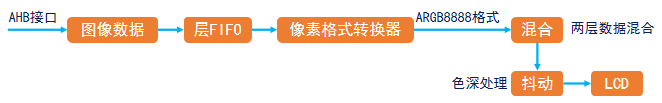

> ARGB8888格式：带8位透明通道，最高8位为透明通道参数，表示透明度，值越大越不透明 ，值越小越透明。剩余24位为RGB参数。

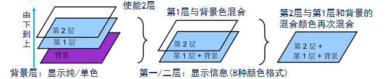

2. 配置和状态寄存器

控制整个LTDC工作参数：各信号的有效电平、垂直/水平同步时间参数、像素格式、数据使能。

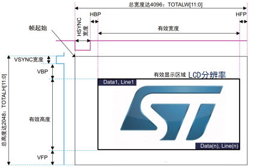

3. AHB接口

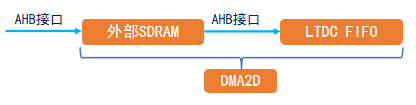

> 由于图像数据所需的数据量很大，通常使用外部 SDRAM 作为显存，通过DMA2D加速将显存数据传入 LTDC FIFO。

### LTDC 寄存器

#### LTDC全局控制寄存器

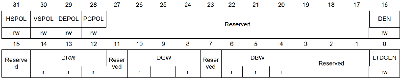

> - `HSPOL`：水平同步极性，控制HSYNC信号极性，根据LCD面板特性设置。
> - `VSPOL`：垂直同步极性，控制VSYNC信号极性，根据LCD面板特性设置。
> - `DEPOL`：数据使能极性，控制DE信号极性，根据LCD面板特性设置。
> - `PCPOL`：像素时钟极性，控制像素时钟极性，根据LCD面板特性设置。
> - `LTDCEN`：TFTLCD控制器使能位，即LTDC开关。

**显示寄存器组**

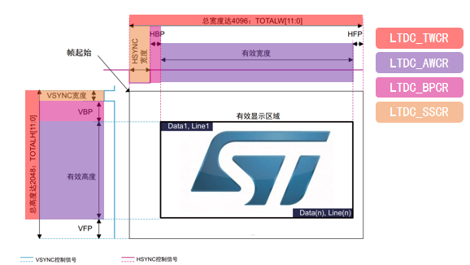

#### LTDC同步大小配置寄存器`LTDC_SSCR`

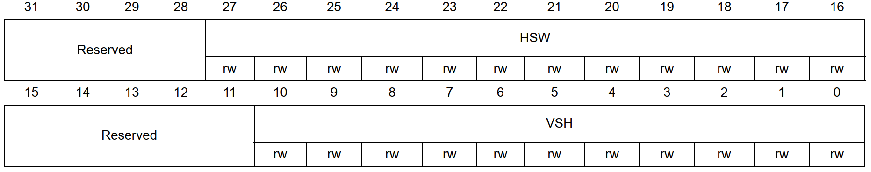

> - `HSW`：表示水平同步宽度（以像素时钟为单位），表示水平同步脉冲减1，即HSW-1。
> - `VSH`：表示垂直同步高度（以水平扫描行为单位），表示垂直同步宽度减1，即VSW-1。

#### LTDC后沿配置寄存器`LTDC_BPCR`

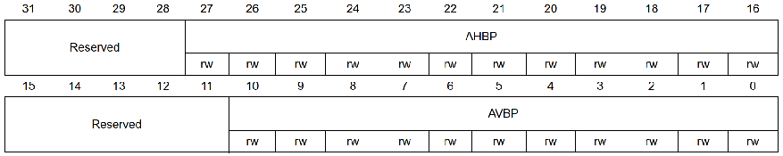

> - `AHBP`：累加水平后沿（以像素时钟为单位），表示HSW+HBP-1；
> - `AVBP`：累加垂直后沿（以水平扫描行为单位），表示VSW+VBP-1；

#### LTDC有效宽度配置寄存器`LTDC_AWCR`

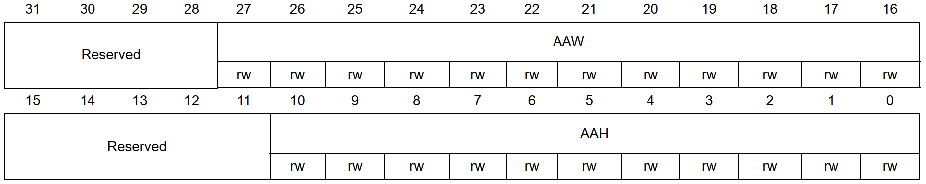

> - `AAW`：累加有效宽度（以像素时钟为单位），表示HSW+HBP+有效宽度-1
> - `AAH`：累加有效高度（以水平扫描行为单位），表示VSW+VBP+有效高度-1

#### LTDC总宽度配置寄存器`LTDC_TWCR`

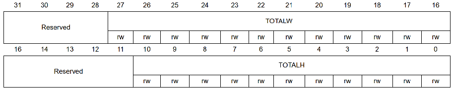

> - `TOTALW`：总宽度（以像素时钟为单位），表示HSW+HBP+有效宽度+HFP-1
> - `TOTALH`：总高度（以水平扫描行为单位），表示VSW+VBP+有效高度+VFP-1

**图层显示寄存器组**

#### LTDC背景色配置寄存器`LTDC_BCCR`

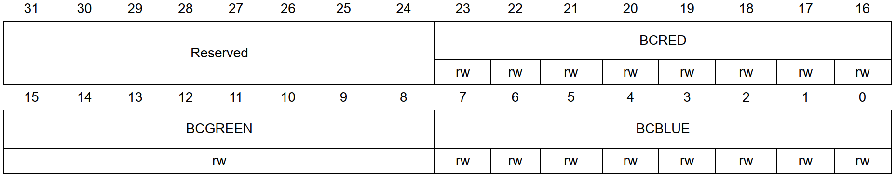

> 定义背景层颜色RGB888，通过低24位配置，一般全设置为0即可。可以使用该图层验证 LTDC 配置是否正确。

#### LTDC层像素格式配置寄存器`LTDC_LxPFCR`

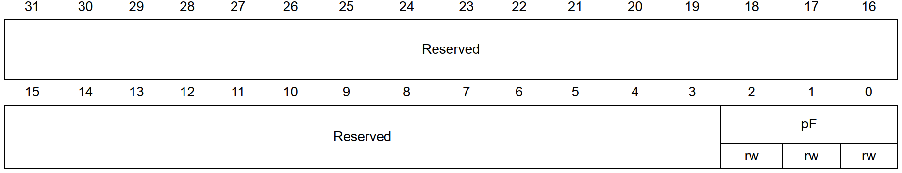

> - 000：ARGB888		
> - 001：RGB888			
> - 010：RGB565
> - 011：ARGB1555		
> - 100：ARGB444		
> - 101：L8(8位 Luminance)
> - 110：AL44(4位Alpha，4位Luminance)			
> - 111：AL88(8位Alpha，8位Luminance)

#### LTDC层窗口水平位置配置寄存器`LTDC_LxWHPCR`

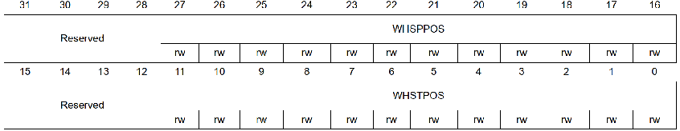

> - `WHSTPOS`：窗口水平起始位置，定义层窗口的一行的第一个可见像素；
> - `WHSPPOS`：窗口水平停止位置，定义层窗口的一行的最后一个可见像素；

#### LTDC层窗口垂直位置配置寄存器`LTDC_LxWVPCR`

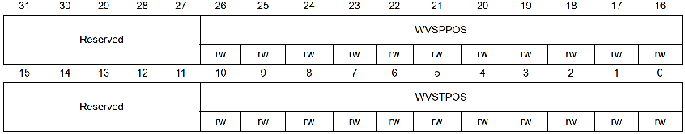

> - `WVSTPOS`：窗口垂直起始位置，定义层窗口的第一个可见行；
> - `WVSPPOS`：窗口垂直停止位置，定义层窗口的最后一个可见行；

#### LTDC层颜色帧缓冲区地址寄存器`LTDC_LxCFBAR`


> 定义一层显存的起始地址。LTDC支持2个层，所以总共有两个寄存器，分别设置层1和层2的显存起始地址。

#### LTDC层颜色帧缓冲区长度寄存器`LTDC_LxCFBLR`

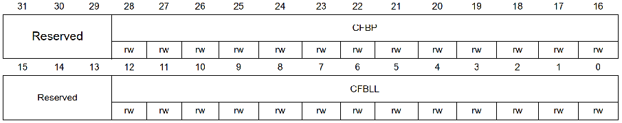

> - `CFBP`：定义从像素某行的起始处到下一行的起始处的增量（以字节为单位）
> - `CFBLL`：定义一行像素的长度（以字节为单位）+ 3

#### LTDC层颜色帧缓冲区行数寄存器`LTDC_LxCFBLNR`

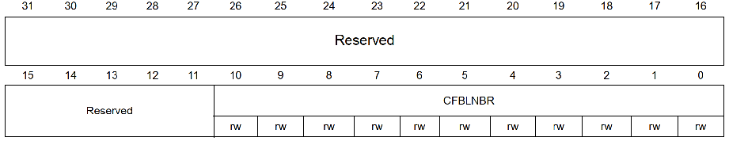

> - `CFBLNBR`：用于定义帧缓冲区行数

#### LTDC层恒定Alpha配置寄存器`LTDC_LxCACR`

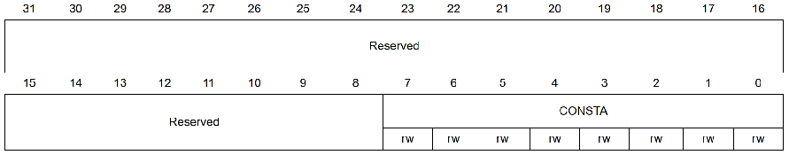

> - `CONSTA`：配置混合时使用的恒定Alpha。恒定Alpha由硬件实现255分频。

#### LTDC层混合系数配置寄存器`LTDC_LxBFCR`

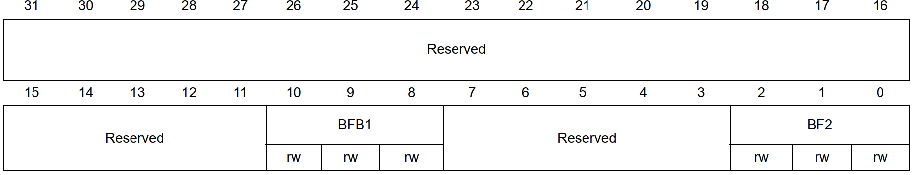

> $$
> BC = BF_1C+BF_2C_S
> $$
>
> $BC$：混合后的颜色；$BF_1$，$BF_2$：混合系数。$C$：当前层的颜色；$C_S$：底层混合后的颜色。
>
> 对于层1来说，$C_S$为背景层颜色，对于层2来说，$C_S$为背景层和层1混合后的颜色。

### LTDC 配置

**以 800*480 4.3寸 RGBLCD ，以RGB565显示格式为例**

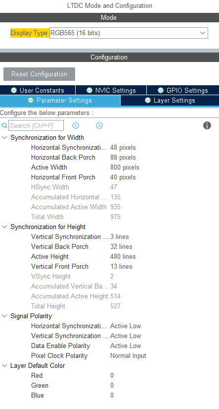


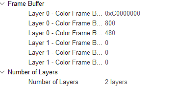

## 3. STM32 DMA2D简介

### DMA2D 框图

DMA2D是由ST公司设计的一个专用于图像处理的专业DMA(Chrom-Art Accelerator)。 存在DMA数据传输功能、2D图形加速功能。

- 工作模式

> 1. 寄存器到存储器：快速单色填充（清屏），无FG和BG，仅输出阶段激活。
>
> 2. 存储器到存储器：快速图像填充，仅激活FG FIFO，作缓冲区。
>
> 3. 存储器到存储器并执行像素颜色格式转换，不会激活BG FIFO。
>
> 4. 存储器到存储器且支持像素颜色格式转换和透明度混合，执行PFC和混合时的FG和BG获取。

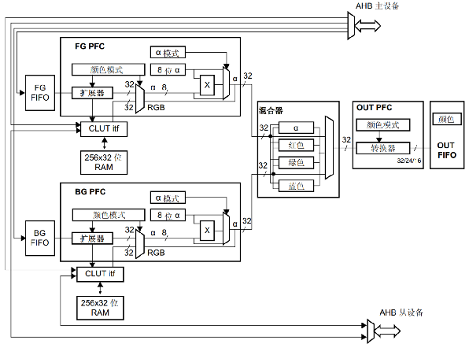

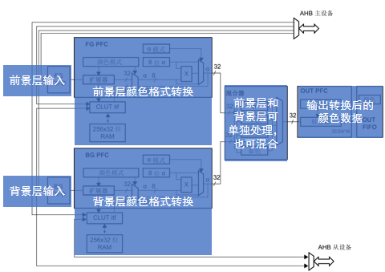

通常使用寄存器操作 DMA2D 实现最大程度加速。

| **寄存器**      | **名称**               | **作用**                     |
| --------------- | ---------------------- | ---------------------------- |
| `DMA2D_CR`      | 控制寄存器             | 用于设置工作模式及启动DMA2D  |
| `DMA2D_OMAR`    | 输出存储器地址寄存器   | 用于设置输出存储器地址       |
| `DMA2D_OOR`     | 输出偏移寄存器         | 用于设置输出行偏移           |
| `DMA2D_NLR`     | 行数寄存器             | 用于设置行数和每行像素数     |
| `DMA2D_OCOLR`   | 输出颜色寄存器         | 用于设置指定的颜色填充       |
| `DMA2D_OPFCCR`  | 输出FPC控制寄存器      | 用于设置输出的颜色格式       |
| `DMA2D_FGPFCCR` | 前景层PFC控制寄存器    | 用于设置前景层输出的颜色格式 |
| `DMA2D_FGMAR`   | 前景层存储器地址寄存器 | 用于设置前景层的存储器地址   |
| `DMA2D_FGOR`    | 前景层偏移寄存器       | 用于控制前景层的偏移         |
| `DMA2D_ISR`     | 中断状态寄存器         | 表示DMA2D各种状态标识        |
| `DMA2D_IFCR`    | 中断标志清零寄存器     | 用于清除ISR寄存器对应的标志  |

**`DMA2D_CR`，`DMA2D_OMAR`，`DMA2D_OOR`用于目标区域设置；`DMA2D_NLR`在R2M中用到；`DMA2D_OCOLR`，`DMA2D_OPFCCR`用于像素格式设置；`DMA2D_FGPFCCR`，`DMA2D_FGMAR`，`DMA2D_FGOR`用于源区域设置。**

### DMA2D 寄存器

#### DMA2D控制寄存器`DMA2D_CR`

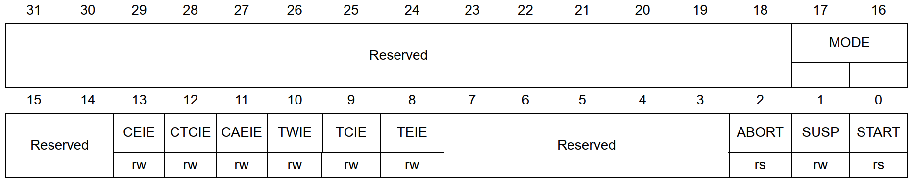

> `MODE`： 表示DMA2D的工作模式（四种）	        
>
> >  00：存储器到存储器				
> >  01：存储器到存储器并执行PFC	        
> >  10：存储器到存储器并执行混合    	
> >  11：寄存器到存储器
> 
> `START`： 控制DMA2D的启动，配置完成后，设置为1，启动DMA2D传输

#### DMA2D输出存储器地址寄存器`DMA2D_OMAR`

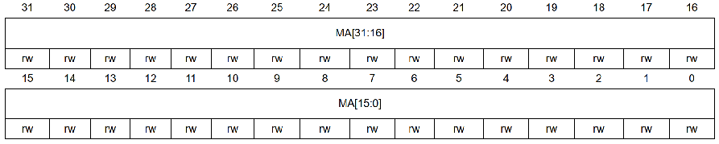

> 用于设置输出存储器地址，也就是输出FIFO所存储的数据地址，该地址需要根据开窗的起始坐标来进行设置。
>
> 前景层存储器地址寄存器`DMA2D_FGMAR`与`DMA2D_OMAR`一样，不过设置的是前景层的存储器地址。

#### DMA2D输出偏移寄存器`DMA2D_OOR`

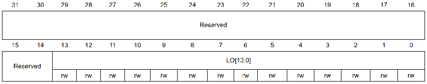

> 用于设置输出行偏移，作用于显示层，以像素为单位。行偏移将添加到各行末尾，用于确定下一行的起始地址。
>
> 前景层偏移寄存器`DMA2D_FGOR`与`DMA2D_OOR`一样，不过设置的是前景层的行偏移。

#### DMA2D行数寄存器`DMA2D_NLR`

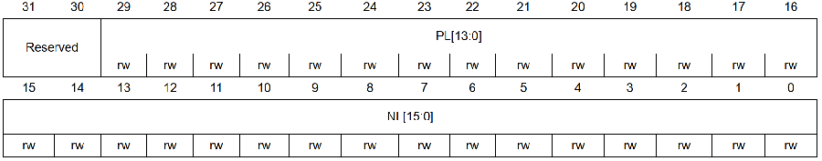

> 该寄存器用于控制每行的像素和行数，该寄存器的设置对前景层和显示层均有效，通过该寄存器的配置，就可以设置开窗的大小。
>
> `NL`：设置待传输区域的行数，用于确定窗口的高度。
>
> `PL`：设置待传输区域的每行像素数，用于确定窗口的宽度。

#### DMA2D输出颜色寄存器`DMA2D_OCOLR`

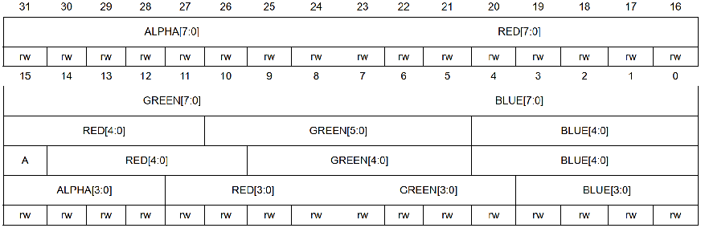

> 用于配置在寄存器到存储器模式下，填充时所用的颜色值。

#### DMA2D输出PFC控制寄存器`DMA2D_OPFCCR`

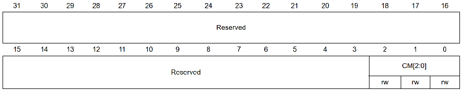

> 该寄存器用于设置寄存器到存储器工作模式下的颜色格式。
>
> CM[2:0]表示颜色格式：
>
> > 000：ARGB8888； 
> >
> > 001：RGB888； 
> >
> > 010：RGB565； 
> >
> > 011：ARGB1555； 
> >
> > 100：ARGB1444；

#### DMA2D前景层PFC控制寄存器`DMA2D_FGPFCCR`

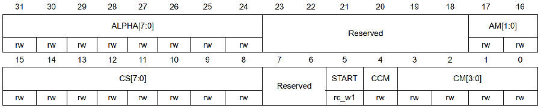

> 该寄存器用于设置存储器到存储器工作模式下的颜色格式。
>
> CM[3:0]表示颜色格式：
>
> > 0000：ARGB8888；
> >
> > 0001：RGB888； 
> >
> > 0010：RGB565； 
> >
> > 0011：ARGB1555；
> >
> > 0100：ARGB4444；
> >
> > 0101：L8； 
> >
> > 0110：AL44； 
> >
> > 0111：AL88； 
> >
> > 1000：L4； 
> >
> > 1001：A8； 
> >
> > 1010：A4；

#### DMA2D中断状态寄存器`DMA2D_ISR`

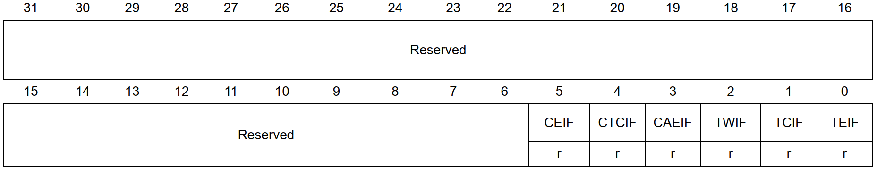

> - `TCIF`位表示DMA2D的传输完成中断标志。当DMA2D传输操作完成时，该位置1，表示可以进行下一次DMA2D传输。
> - DMA2D中断标志清零寄存器`DMA2D_IFCR`，用于清除DMA2D_ISR寄存器对应位的标志。若DMA2D传输完成，向`CTCIF`位写1即可清除DMA2D_ISR寄存器的`TCIF`位标志。

### DMA2D 的使用

[DMA2D 使用示例][https://blog.csdn.net/rtthreadiotos/article/details/118347934]

1. 颜色填充

> - DMA2D 设置为 R2M 模式
> - 使用`OMAR`确定起始区域，使用`NLR`确定填充宽度和填充高度，使用`OOR`确定填充一行后需要跳过多少像素。
> - 填充内容使用`OCOLR`和`OPFCCR`设置。
> - 启用 DMA2D ,检测`ISR`和使用`IFCR`清理标志位。

```c
static inline void DMA2D_Fill( void * pDst, uint32_t width, uint32_t height, uint32_t lineOff, uint32_t pixelFormat,  uint32_t color) 
{
    /* DMA2D配置 */  
    DMA2D->CR      = 0x00030000UL;                                  // 配置为寄存器到储存器模式
    DMA2D->OCOLR   = color;                                         // 设置填充使用的颜色，格式应该与设置的颜色格式相同
    DMA2D->OMAR    = (uint32_t)pDst;                                // 填充区域的起始内存地址
    DMA2D->OOR     = lineOff;                                       // 行偏移，即跳过的像素，注意是以像素为单位
    DMA2D->OPFCCR  = pixelFormat;                                   // 设置颜色格式
    DMA2D->NLR     = (uint32_t)(width << 16) | (uint16_t)height;    // 设置填充区域的宽和高，单位是像素

    /* 启动传输 */
    DMA2D->CR   |= DMA2D_CR_START;   

    /* 等待DMA2D传输完成 */
    while (DMA2D->CR & DMA2D_CR_START) {} 
}
```

2. 图像传输

> - DMA2D 设置为 M2M 模式。
> - 使用`OMAR`，`FGMAR`确定起始区域，使用`NLR`确定填充宽度和填充高度，使用`OOR`，`FGOR`确定填充一行后需要跳过多少像素。
> - 填充内容使用`OCOLR`和`OPFCCR`设置。
> - 启用 DMA2D ,检测`ISR`和使用`IFCR`清理标志位。

```c
static void DMA2D_MemCopy(uint32_t pixelFormat, void * pSrc, void * pDst, int xSize, int ySize, int OffLineSrc, int OffLineDst)
{
    /* DMA2D配置 */
    DMA2D->CR      = 0x00000000UL;
    DMA2D->FGMAR   = (uint32_t)pSrc;
    DMA2D->OMAR    = (uint32_t)pDst;
    DMA2D->FGOR    = OffLineSrc;
    DMA2D->OOR     = OffLineDst;
    DMA2D->FGPFCCR = pixelFormat;
    DMA2D->NLR     = (uint32_t)(xSize << 16) | (uint16_t)ySize;

    /* 启动传输 */
    DMA2D->CR   |= DMA2D_CR_START;

    /* 等待DMA2D传输完成 */
    while (DMA2D->CR & DMA2D_CR_START) {}
}
```

