# STM32 Hardware 8_USB

## 1. USB 基本概念

### USB 接口类型和标准

USB 接口有不同的形状和设计，最初只有两种 USB 类型：USB-A 和 USB-B。现在，又衍生出了更多地接口类型，包括 USB-C、USB Micro、USB Mini 和 Lightning Cable，如下图所示：

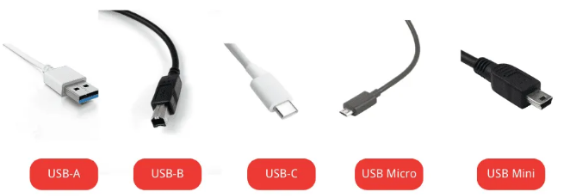

> 1. **USB-A**：最常见的USB类型，主要应用于有线鼠标、键盘和U盘。它的线缆端较宽，由于该连接器没有旋转对称性，两端不同，对应不同类型的端口。
> 2. **USB-B**：中间为小矩形孔形状。它通常不用于现代计算机，但在打印机、路由器和扫描仪上常见。
> 3. **USB-C**：有一个更扁平、更小的公口，中间的孔是扁平的椭圆形，适合小型连接器针脚插入。它是取代 USB-A 和 USB-B 的新标准，更适用于较薄的设备，如 MacBook 和手机。
> 4. **USB Micro**：USB-A 和 USB-B 都有 Micro 大小的版本。Micro USB 是如今许多智能手机中非常常见的 USB 连接器。然而，随着 USB Type C 的出现，Micro USB正在慢慢被淘汰，不再用于新款高端智能手机。但 Micro USB 仍然广泛应用于全球的廉价智能手机和其他电子设备中。
> 5. **USB Mini**：同样有两种分为USB Mini A和USB Mini B。它们是 Type A 和Type B USB 连接器的缩小版，一般用于便携式相机、游戏控制器和一些老款移动电话中。
> 6. **Lightning Cable**：主要用于iPhone和iPad，采用完全不同类型的USB连接器，即 Lightning cable。这种线缆的一端有一个薄的矩形连接器，另一端是 Type C 连接器。Lightning cables 没有正反面的区分，不用担心插入的正反。（但是很容易引发火灾）

-----

- USB支持三种速度：低速(1.5Mbps)、全速(12Mbps)和高速(480Mbps)。
  - **USB 2.0 标准**：高速USB，最大数据传输速度为480Mbps，支持所有类型的连接器，最大电缆长度为5米，最大充电功率为15瓦。
  - **USB 3.2 标准(第一代)**：超高速USB，最大数据传输速度为5Gbps，支持USB-A 3.0、USB-B 3.0 和 USB-C 等不同连接器，最大电缆长度为3米，最大充电功率为15瓦。
  - **USB 3.2 标准(第二代)**：超高速USB，最大数据传输速度为10Gbps，最大电缆长度为1米，支持不同类型的连接器，最大充电功率为100瓦。
  - **USB 3.2 标准(第三代)**：超高速USB，最大数据传输速度为20Gbps，最大电缆长度为1米，支持USB连接器，最大充电功率为100瓦。
  - **Thunderbolt 3 标准**：最大数据传输速度高达40Gbps，最大电缆长度为2米(主动电缆,即包括放大和补偿信号的芯片转换的电缆)和0.8米(被动电缆)，支持USB连接器，最大充电功率为100瓦。
  - **USB 4 标准**：也称为Thunderbolt 4，最大数据传输速度高达40 Gbps，最大电缆长度为2米(主动电缆)和0.8米(被动电缆)，支持USB连接器，最大充电功率为100瓦。

### USB 引脚分布

- USB 2.0 引脚分布

  USB2.0 共 4 条线，其中数据通过 D+ 和 D- 连接器传输，而 Vbus 和 GND 为USB设备供电。

  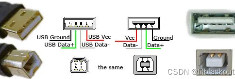

- USB 3.0 引脚分布

  USB3.0多了5个引脚：两根高速发送引脚、两根高速接收引脚和参考地。之所以预留原来的4个引脚是为了兼容USB2.0。

  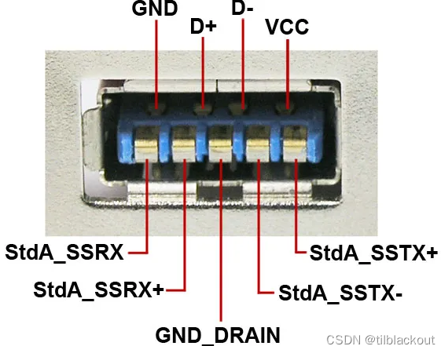

  

### USB 体系架构

USB 是一种主从结构的系统，数据交换只能发生在主从设备之间，且只能由主机主动发起。

USB 主机具有一个或者多个 USB 主控制器(Host controller)和根集线器(Root Hub)。

> **USB主控制器**：主要负责数据处理。
>
> **根集线器**：提供一个连接主控制器与设备之间的接口和通路。

USB集线器(USB Hub)：用于对原有的USB接口数量进行扩展，但不能扩展更多的带宽。

每个I/O设备都会进行点对点连接，通过串行传输格式来传输数据。

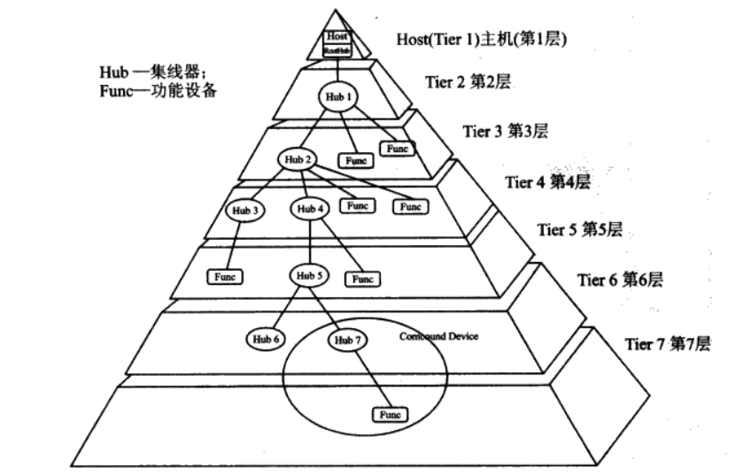

USB 协议的工作基于轮询机制，CPU 会持续检查输入/输出设备是否准备好传输数据。因此，I/O 设备无需向处理器更新它们的状况。

每当新的设备连接到集线器时，它会被分配一个地址，第一个设备的地址为 0。正常情况下，主机会对集线器进行轮询以获取其状况，从而使主机知道系统中的 I/O 设备是连接还是断开的。

一旦主机响应新设备，它通过读取设备的 USB 接口的特定内存中的可用数据来了解设备的容量。然后，主机使用适当的驱动程序与设备通信。接着，主机分配一个地址给新设备，该地址写入设备寄存器。通过这个功能，USB 提供了即插即用的功能，允许主机自动识别新的可用 I/O 设备。

USB协议的另一个特点是热插拔，这意味着可以在不关闭或重启的情况下连接或断开 I/O 设备，因此当 I/O 设备连接或断开时，系统可以持续运行。

USB 协议还可以支持等时传输，即数据在预定的时间间隔内传输。相比同步和异步数据传输，等时数据传输的传输速度非常快。为了保持等时的传输，根集线器通过USB 发送一系列位，这些位指定了等时数据的开始，实际的数据可以在这一系列位之后传输。

### USB 传输时序

USB 采用反向不归零编码（NRZI）来传输数据：当下一个电平为 0 时，电平反转；当下一个电平为 1 时，电平不变。

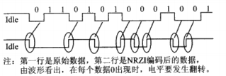

每个 USB 数据包，最开始都有一个同步域（SYNC），接受者通过此包来计算出发送者的 USB 数据的频率。同时由于遇到逻辑 0 时比特位会翻转，接收者也一直在根据这个特性在调整 USB 的同步频率。

为了防止出现长时间的电平不变化（不利于提取时钟信号），发送数据前应该经过位填充处理（遇到 6 个数据 1 时，插入数据 0）。

位填充后的数据，由串行接口引擎将数据串行化和 NRZI 编码后，发送到数据线后，接收方将数据并行化，然后去掉位填充恢复数据。

### USB 的描述符及其关系

设备的功能和行为通过描述符实现。USB 1.1 中定义的标准描述符有**设备描述符，配置描述符，接口描述符，端点描述符，字符串描述符**。

**一个 USB 设备只有一个设备描述符，设备描述符决定了该设备有多少个配置，每一种配置都有一个配置描述符，每一个配置描述符中定义了配置中有多少个接口，每一个接口有一个接口描述符，每一个接口描述符定义了该接口有多少个端点，每一个端点都有一个端点描述符，端点描述符定义了端点的大小和类型**。

一个设备可以有多个配置，但是同一时刻只能对一个配置有效，选用不同功能时选用不同配置即可。同一个端点号不能出现在同一个配置下的两个或者多个接口中。

> - 设备描述符：设备使用的 USB 协议版本，设备类型，端点0的最大包大小，厂商 ID(VID)，产品ID(PID)，设备版本号，厂商字符串索引，产品字符串索引，设备序列号索引，可能的配置数。
>
>   |偏移	|域	|大小(Bytes)	|描述
>   |-|-|-|-|
>   |0	|bLength	|1	|设备描述符的长度(字节为单位)
>   |1|	bDescriptorType|	1	|描述符的类型
>   |2	|bcdUSB	|2	|设备支持的USB版本(使用BCD码表示)，如USB2.0为0x0200
>   |4	|bDeviceClass	|1	|设备的类
>   |5|	bDeviceSubClass|	1|	设备的子类
>   |6	|bDeviceProtocol|	1	||设备协议
>   |7|	bMaxPacketSize0|	1	|端点0的最大包长度(8/16/32/64 Bytes)
>   |8|	idVendor|	2	|制造商ID
>   |10|	idProduct	|2|	产品ID
>   |12|	bcdDevice	|2|	设备版本号(以BCD码描述)
>   |14|	iManufacturer|	1	|制造商信息在USB描述符中的索引,不存在应置0
>   |15|	iProduct	|1	|产品信息在USB描述符中的索引,不存在应置0
>   |16|	iSerialNumber	|1	|序列号在USB描述符中的索引,不存在应置0
>   |17	|bNumConfigurations	|1	|设备可以支持的总配置数
>
> - 配置描述符：配置所含的端口数，配置的编号，供电方式，是否支持远程唤醒，电流需求。
>
>   |偏移	|域	|大小(Bytes)|	描述
>   |-|-|-|-|
>   |0	|bLength|	1	|设备描述符的长度(字节为单位)
>   |1	|bDescriptorType|	1|	描述符的类型
>   |2	|wTotalLength	|2	|配置描述符的接口和端点描述符的总长度
>   |4	|bNumInterfaces	|1	|配置中的接口总数
>   |5	|bConfigurationValue	|1|	配置值(给SET_CONFIGURATION使用的来选择此配置的值)
>   |6	|iConfiguration	|1	|描述此配置的字符串的索引
>   |7	|bmAttributes	|1|	Bit7:保留(默认为1)；Bit6:0-总线供电 1-自供电；Bit5:0-支持远程唤醒 1-不支持远程唤醒
>   |8	|bMaxPower|	1	|设备全速运行时消耗的最大功率(2mA为单位)
>
> - 接口关联描述符：描述了与单个设备功能相关联的两个或多个接口。接口关联描述符通知主机这些接口是连接在一起的。
>
>   |偏移	|域	|大小(Bytes)	|描述
>   |-|-|-|-|
>   |0	|bLength	|1	|设备描述符的长度(字节为单位)
>   |1	|bDescriptorType|	1	|描述符的类型
>   |2	|bFirstInterface|	1	|与该功能相关联的第一个接口的编号
>  | 3	|bInterfaceCount	|1	|与该功能相关联的连续接口的数量(即第一个开始数后面连续多少个)
>   |4	|bFunctionClass	|1|	类别码
>  | 5	|bFunctionSubClass|	1|	子类码
>   |6	|bFunctionProtocol|	1	|协议码
>   |7	|iFunction	|1|	该功能的字符串描述符索引
>
> - 接口描述符：接口的编号，接口的端点数，接口使用的类，子类，协议。
>
>   |偏移	|域	|大小(Bytes)	|描述|
>   |-|-|-|-|
>   |0	|bLength|	1|	设备描述符的长度(字节为单位)
>   |1	|bDescriptorType|	1|	描述符的类型
>   |2	|bInterfaceNumber|	1|	该接口在特定USB配置中的索引
>   |3	|bAlternateSetting|	1|	描述接口的不同配置或操作模式(可理解为功能复用)
>   |4	|bNumEndpoints	|1	|此接口使用的端点数量(不包括端口0)
>   |5	|bInterfaceClass|	1|	接口类
>   |6|	bInterfaceSubclass|	1	|接口子类
>   |7	|bInterfaceProtocol	|1|	接口协议
>   |8	|iInterface	|1|	描述此接口的字符串索引
>
> - 端点描述符：端点号和端点方向，端点的数据类型，最大包长度，查询时间间隔。
>
>   |偏移|	域|	大小(Bytes)|	描述
>   |-|-|-|-|
>   |0	|bLength	|1	|设备描述符的长度(字节为单位)
>   |1	|bDescriptorType	|1	|描述符的类型
>   |2	|bEndpointAddress	|1	|bit[3:0]:端点号；bit[6:4]:保留,默认为0；bit[7]:方向,0-out 1-IN,控制端点将忽略此字段
>   |3	|bmAttributes	|1	|bit[1:0]:传输类型,00-控制,01-等时,10-批量,11-中断；如果是等时端点，bit[5:2]的定义如下(若不是下面字段则忽略)：bit[3:2]:同步类型,00-不同步,01-异步,10-自适应,11-同步；bit[5:4]:使用类型,00-数据端点,01-反馈端点,10-隐式反馈数据端点,11-保留
>   |4|	wMaxPacketSize	|2|	该端点的最大数据包大小
>   |6|	bInterval	|1	|中断端点的轮询间隔，以毫秒为单位(等时端点为1，控制或批量端点则该字段忽略）

### USB 设备的枚举过程

枚举：从设备读取各种描述符的信息，主机根据这些信息加载合适的驱动。设备枚举采用控制传输。

控制传输分为**建立过程，可选的数据过程，状态过程**。

建立过程由 USB 主机发起，由 SETUP 令牌数据包开始，紧跟一个 DATA0 数据包，接着是数据过程，如果时控制读传输，则数据过程就是输入数据，如果是控制写传输，则数据过程是输出数据。如果在建立过程中指定数据长度为0，则没有数据过程。数据过程后是状态过程，状态过程的传输方向和数据过程相反。

1. USB 主机检测到设备插入时，先对设备复位，USB 设备在总线复位后的地址为0，主机通过地址0和刚刚插入的设备通信，USB 主机向地址为0的设备的端点0发送获取设备描述符的标准请求，设备收到请求后，按照主机请求的参数，在数据过程将设备描述符传递给主机。主机在成功获取到设备描述符并确认无误后，返回0长度的确认数据包（状态过程）给设备。

   标准设备描述有18个字节，有的USB设备的端点0大小不足18字节，此时 USB 主机只会发送一次请求，获取到前八字节后就能知道端点0的最大包长度。

2. 主机对设备又一次复位，进入到设置地址阶段。USB 主机向地址为0的设备的端点0发出设置地址的请求。新的设备地址包含在建立过程的数据包中（主机分配唯一的设备地址给刚接入的设备）。USB设备在接收到建立过程后，直接进入到状态过程。设备等待主机请求状态返回后，返回一个长度为0的状态数据包。主机收到该包后发送应答包，设备收到应答包后启用新的设备地址。

3. 主机再次获取设备描述符，此时获取全部的设备描述符。

4. 主机获取配置描述符，根据描述符中的配置集合总长度获取配置集合。

### USB 的包结构

USB 的数据以包为基本传输单位，一个包有不同的域。每一个包总有同步域SYNC,其后有一个包标识符PID，最后通过包结束符EOF结束传输。

> 1. 同步域SYNC：用来告诉USB的串行接口引擎数据要开始传输了，请做好准备。除此之外，同步域还可以用来同步主机端和设备端的数据时钟，因为同步域是以一串0开始的，而0在USB总线上就被编码为电平翻转，结果就是每个数据位都发生电平变化，这让串行接口引擎很容易就能恢复出采样时钟信号。
>
>    对于全速设备和低速设备，同步域使用的是00000001（总线上的发送顺序）;对于高速设备，同步域使用的是31个0，后面跟1个1（这是对发送端的要求，接收端解码时，0的个数可以少于这个数）。
>
> 2. 包结束符 EOP：对于高速设备和全速/低速设备也是不一样的。全速/低速设备的 EOP 是一个大约为2个数据位宽度的单端0（SEO）信号。SE0 的意思就是，D+和 D- 同时都保持为低电平。由于 USB 使用的是差分数据线，通常都是一高一低的，而 SEO 不同，是一种都为低特殊的状态。SE0用来表示一些特殊的意义，例如包结束、复位信号等。前面提到 USB 集线器对 USB 设备进行复位的操作，就是通过将总线设置为 SEO 状态大约10 ms 来实现的。对于高速设备的 EOP,使用故意的位填充错误来表示。由CRC校验判断一个位填充错误是真的位填充错误还是包结束，如果CRC校验正确，则说明这食位填充错误是 EOP，否则，说明传输出错。
>
> 3. 包标识符PID：是用来标识一个包的类型的。它总共有 8 位，其中 USB 协议使用的只有4位(PID0～PID3)，另外4位(PID4～PID7)是PID0～PID3 的取反，用来校验 PID。USB协议规定了4类包，分别是：令牌包(token packet,PID1～0为01)、数据包(data packet,PID1～0为11)、握手包(handshake packet,PID1～0为10)和特殊包(special packet,PID1～0为00)。不同类的包又分成几种具体的包。

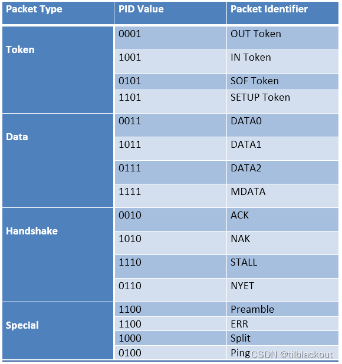

#### 令牌包

令牌包用来启动一次 USB 传输。令牌包有4种，分别为输出(OUT)、输入(IN)、建立(SETUP)和帧起始(SOF Start Of Frame)。

> - 输出令牌包用来通知设备将要输出一个数据包。
> - 输入令牌包用来通知设备返回一个数据包。
> - 建立令牌包只用在控制传输中，它跟输出令牌包的作用一样，也是通知设备将要输出一个数据包，两者的区别在于：SETUP 令牌包后只使用 DATA0 数据包，且只能发到设备的控制端点，并且设备必须要接收，而 OUT 令牌包没有这些限制。
> - 帧起始包在每帧(或微帧)开始时发送，它以广播的形式发送，所有 USB 全速设备和高速设备都可以接收到 SOF 包。USB 全速设备每毫秒产生一个帧，而高速设备每 125μs 产生一个微帧。USB 主机会对当前帧号进行计数，在每次帧开始时(或者微帧开始时，每毫秒有 8个微帧，这 8个微帧的帧号是一样的，即相同的 SOF)通过 SOF 包发送帧号。SOF 中的帧号是11位的。在4个令牌包中，只有 SOF 令牌包之后不跟随数据传输，其他的都有数据传输。

每个令牌包，最后都有一个 CRC5 的校验，它只校验 PID 之后的数据，不包括 PID本身，因为 PID 本身已经有 4 个取反的位进行校验了。

对于 IN、OUT 和 SETUP 令牌数据包，有一个7位的设备地址、4位的端点ID和5位的 CRC。


SOF 数据包包含一个8位 SOF PID、11位帧计数值，以及一个5位 CRC。


#### 数据包

数据包用来传输数据。在 USB 1.1 协议中，只有两种数据包：DATA0 包和 DATA1包。在 USB 2.0 中又增加了 DATA2 和 MDATA 包，主要用在高速分裂事务和高速高带宽同步传输中。

数据包都具有同样的结构：一个同步域，后面跟整数字节的数据，然后是CRC16 校验，最后是包结束符EOP。


主机和设备都会维护自己的一个数据包类型切换机制：当数据包成功发送或者接收时，数据包类型切换。当检测到对方所使用的数据包类型不对时，USB 系统认为这发生了一个错误，并试图从错误中恢复。

#### 握手包

握手包用来表示一个传输是否被对方确认。握手包只有同步域、PID和 EOP。

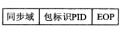

握手包有 ACK、NAK、STALL 和 NYET。 

> - ACK 表示正确接收数据，并且有足够的空间来容纳数据。主机和设备都可以用 ACK 来确认，而 NAK、STALL、NYET只有设备能够返回，主机不能使用这些握手包。
> - NAK 表示没有数据需要返回，或者数据正确接收但是没有足够的空间来容纳它们。当主机收到 NAK 时，知道设备还未准备好，主机会在以后合适的时机进行重试传输。
> - STALL 表示设备无法执行这个请求，或者端点已经被挂起了，它表示一种错误的状态。设备返回 STALL 后，需要主机进行干预才能解除这种 STALL 状态。
> - NYET 只在 USB 2.0 的高速设备输出事务中使用，它表示设备本次数据成功接收，但是没有足够的空间来接收下一次数据。主机在下一次输出数据时，将先使用 PING 令牌包来试探设备是否有空间接收数据，以避免不必要的带宽浪费。

#### 特殊包

1. PRE 是通知集线器打开其低速端口的一种前导包。PRE 只使用在全速模式中。平时，为了防止全速信号使低速设备误动作，集线器是没有将全速信号传送给低速设备的。只有当收到 PRE令牌包时，才打开其低速端口。PRE 令牌包与握手包的结构一样，只有同步域、PID和 EOP。当需要传送低速事务时，主机首先发送一个 PRE 令牌包(以全速模式发送)。对于全速设备，将会忽略这个令牌包。集线器在收到这个令牌包后，打开其连接了低速设备的端口。接着，主机就会以低速模式给低速设备发送令牌包、数据包等。
2. PING 令牌包与 OUT 令牌包具有一样的结构，但是 PING 令牌包后并不发送数据，而是等待设备返回 ACK 或者 NAK，以判断设备是否能够传送数据。
3. SPLIT 令牌包是高速事务分裂令牌包，通知集线器将高速数据包转化为全速或者低速数据包发送给其下面的端口。
4. ERR 握手包是在分裂事务中表示错误使用。

### USB 的传输事务

按照一定的关系把这些不同的包组织成事务(transaction)才能传输数据。事务通常由两个或者三个包组成：**令牌包、数据包和握手包**。

> 1. 令牌包用来启动一个事务，总是由主机发送；
> 2. 数据包传送数据，可以从主机到设备，也可以从设备到主机，方向由令牌包来指定；
> 3. 手包的发送者通常为数据接收者，当数据接收正确后，发送握手包。设备也可以使用 NAK 握手包来表示数据还未准备好。

USB协议规定了4种传输类型：批量传输、等时传输(也有的翻译为同步传输)中断传输和控制传输。其中，批量传输、等时传输、中断传输每传输一次数据都是一个事务；控制传输包括三个过程，建立过程和状态过程分别是一个事务，数据过程则可能包含多个事务。

#### 批量传输

批量传输使用批量事务(bulk transaction)传输数据。一次批量事务有三个阶段：令牌包阶段、数据包阶段和握手包阶段。

每个阶段都是一个独立的包。

批量传输分为批量读和批量写(记住，输入还是输出是以主机为参考的，批量读使用
批量输入事务，批量写使用批量输出事务。

1. 批量输出事务

   主机先发出一个 OUT 令牌包，这个令牌包中包含了设备地址、端点号。然后，再发送一个 DATA 包(具体是什么类型的 DATA 包，要看数据切换位),这时地址和端点匹配的设备就会收下这个数据包。然后主机切换到接收模式，等待设备返回握手包。设备解码令牌包、数据包都准确无误，并且有足够的缓冲区来保存数据后，就会使用 ACK 握手包或者 NYET 握手包来应答主机(只有高速模式才有NYET 握手包，它表示本次数据成功接收，但是没有能力接收下一次传输)。如果没有足够的缓冲区来保存数据，那么它就会返回一个 NAK 握手包，告诉主机目前没有缓冲区可用，主机会在稍后的时间重试该批量输出事务。如果设备检测到数据正确，但是端点处于挂起状态，则返回一个 STALL 握手包。如果设备检测到有错误(例如校验错误、位填充错误等),则不做任何响应，让主机等待超时。

2. 批量输入事务

   主机首先发出一个 IN 令牌包，同样，IN 令牌包中包含了设备地址和端点号。然后主机切换到接收数据状态，等待设备返回数据。如果设备检测到错误，那么不做任何响应，主机等待超时。如果此时有地址和端点匹配的设备，并且没有检测到错误，则该设备要做出响应：如果设备有数据需要返回，那么它把一个数据包放到总线上(具体的数据包类型要看数据切换位);如果设备没有数据需要返回，则它直接使用 NAK 握手包来响应主机；如果该端点处于挂起状态，设备会返回一个 STALL 握手包。如果主机接收到设备发送的数据包并解码正确后，使用 ACK 握手包应答设备。如果主机检测到错误，则不做任何响应，设备会检测到超时。主机在收到 NAK 握手包后，知道设备暂时无数据返回，主机会在稍后的时间里重试该输入事务。

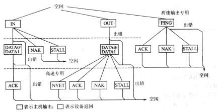

平时无数据传输时，总线处于空闲状态。当需要传输一次事务时，主机发送一个令牌包，它可以是OUT 令牌包、IN 令牌包或者是 PING 令牌包。如果设备解码令牌包时出错，则直接进入空闲状态。

令牌阶段之后是数据阶段或者握手阶段。对于批量输入事务，则由设备返回数据，或者返回应答包 NAK 握手包或 STALL 握手包。这由设备的状态来决定。对于批量输出事务，则主机在令牌包后面再发送一个数据包。PING 令牌用来探测设备是否有空间接收数据，它没有数据阶段，只有握手阶段，设备根据实际的情况返回握手包。ACK 握手包表示有空间接收数据，NAK 握手包表示无空间接收，STALL 握手包表示端点挂起。

最后是握手阶段。对于批量输入事务，如果主机接收设备返回的数据正确，则由主机返回 ACK 握手包；否则数据错误，主机什么也不返回。主机必须要能够接收数据，不能用 NAK 握手包回应设备。对于批量输出事务，如果设备能够接收数据，则返回 ACK 握手包；如果设备没有空间接收数据包，则返回 NAK 握手包；如果设备端点挂起，则返回 STALL 握手包；如果设备检测到传输错误，则什么都不回应，直接进入到空闲状态。

一次正确的批量输入：

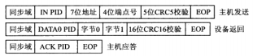

一次正确的批量输出：

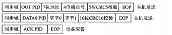

批量传输的端点，高速模式固定为 512 字节，全速模式最大包长可在 8、16、32、64字节中选择，低速模式不支持批量传输。

#### 中断传输

中断传输是一种保证查询频率的传输。中断端点在端点描述符中要报告它的查询间隔，主机会保证在小于这个时间间隔的范围内安排一次传输。

中断传输是由主机保证在不大于某个时间间隔内安排一次传输。中断传输通常用在数据量不大，但是对时间要求较严格的设备中，例如人机接口设备(HID)中的鼠标、键盘、轨迹球等。中断传输也可以用来不断地检测某个状态，当条件满足后再使用批量传输来传送大量的数据。

中断传输和批量传输的结构基本上是一样的，只是中断传输中没有 PING 和 NYET两种包，中断传输使用中断事务(interrupt transaction)。

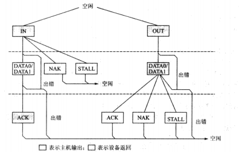

中断传输的端点，低速模式最大包长上限为8字节，全速模式最大包长上限为64
字节，高速模式最大包长上限为1024字节。

#### 等时传输

等时传输(同步传输)用在数据量大、对实时性要求高的场合，例如音频设备、视频设备等，这些设备对数据延迟很敏感。对于音频或者视频设备来说，对数据的100%确要求不高，少量数据的错误还是能够容忍的，主要的是要保证不能停顿；所以等时传输是不保证数据100%准确的。当数据错误时，并不进行重传操作。因此等时传输也就没有应答包。数据是否正确，可以由数据包的CRC校验来确认。至于出错的数据如何处理，由软件来决定。

等时传输使用等时事务(isochronous transaction)来传输数据。

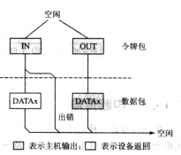

等时传输的端点，全速模式最大包长上限为1023 字节，高速模式最大包长上限为
1024 字节，低速模式不支持等时传输。

#### 控制传输

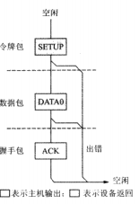


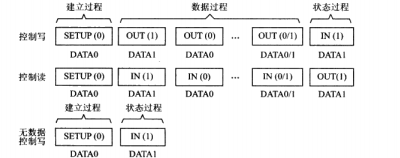

控制传输的端点，低速模式最大包长固定为8字节，高速模式最大包长固定为64
字节，而全速模式可在 8、16、32、64字节中选择。

一个具体的端点，只能工作在一种传输模式下。通常，我们把工作在什么模式下的端点，就叫做什么端点。例如，控制端点、批量端点等。

端点0是每个 USB设备都必须具备的默认控制端点，它一上电就存在并且可用。设备的各种描述符以及主机发送的一些命令，都是通过端点0传输的。其他端点是可选的，需要根据具体的设备来决定。非0端点只有在 Set Config 之后才能使用。

### USB 设备类

USB开发者论坛有一个被承认和批准的USB设备类列表。最常见的设备类包括：

> - 人机接口设备(Human Interface Device,HID)
> - 大容量存储设备(Mass Storage Device,MSD)
> - 通信设备类(Communication Device Class,CDC)
> - 厂商(Vendor Specific,特定尝试开发的USB类)

|类代码	|用途(即类信息的使用范围)	|描述	|例子|
|-|-|-|-|
|00h	|设备	|未定	|当设备类别未指定时，接口描述符用于确定所需的驱动程序
|01h	|接口	|音频|	扬声器、麦克风、声卡、MIDI
|02h	|设备/接口|	通信和CDC控制	|调制解调器、以太网适配器、Wi-Fi适配器
|03h	|接口|	HID(Human Interface Device)	|键盘、鼠标、摇杆
|05h	|接口	|PID(Physical Interface Device)	|力反馈操纵杆
|06h	|接口	|图像	|摄像机、扫描仪
|07h	|接口	|打印	|打印机、计算机数控机器
|08h	|接口	|大容量存储	|外部硬盘、闪存驱动器、存储卡
|09h	|设备	|USB集线器|	USB集线器
|0Ah	|接口	|CDC数据	|与上面的02h类一起使用
|0Bh	|接口	|智能卡	|USB智能卡读取器
|0Dh	|接口	|信息安全	|指纹读取器
|0Eh	|接口	|视频	|网络摄像头
|0Fh	|接口	|个人健康护理	|心跳监测器、血糖仪
|DCh	|设备/接口	|诊断设备	|测试USB设备是否符合USB标准/规范的设备
|E0h	|接口	|无线控制器	|蓝牙适配器
|EFh	|设备/接口	|杂项	|如微软的ActiveSync :同步手机和电脑数据的APP
|FEh	|接口	|应用特定的	|红外桥接器、测试与测量类，USB DFU(直接固件更新,即通过USB升级固件)
|FFh	|设备/接口	|供应商特定的	|表示一个设备需要供应商特定的驱动

## 2. STM32 USB

### STM32 的 USB 框架

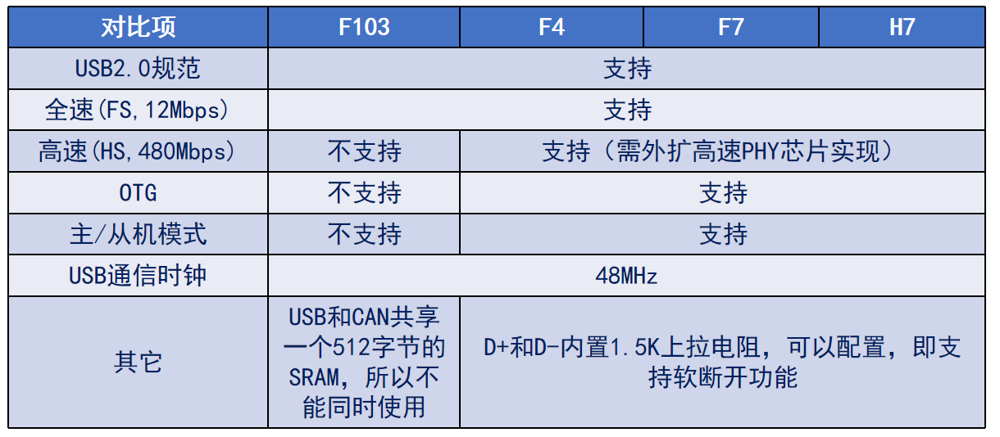

- USB 时钟

  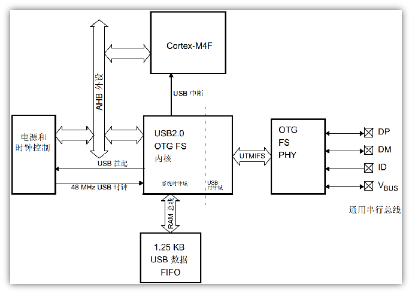

- ST 官方 USB 驱动库

  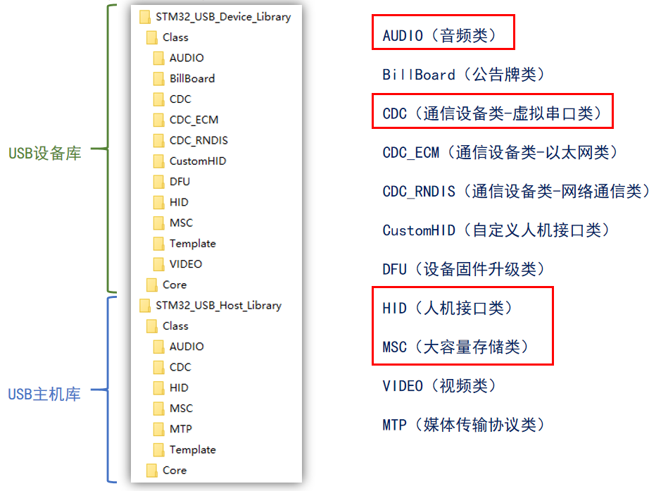

### HAL USB 虚拟串口

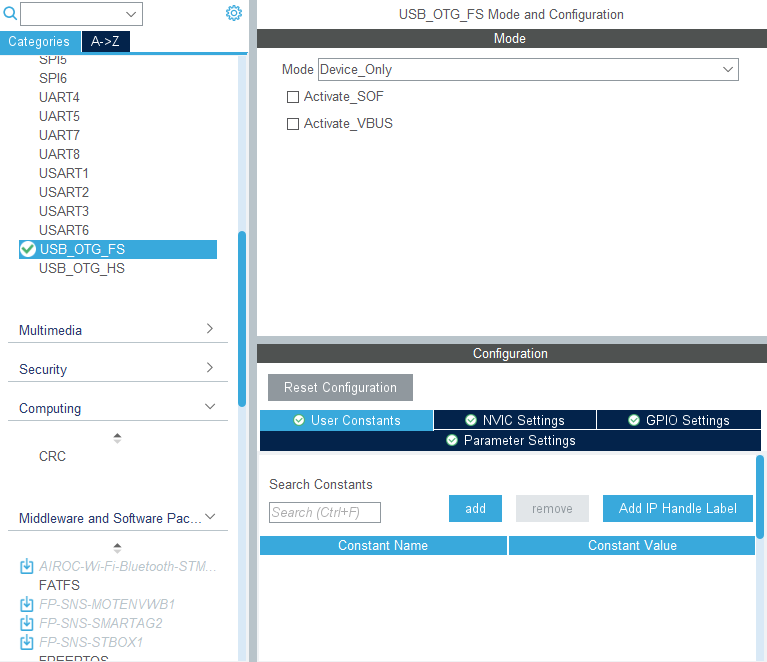

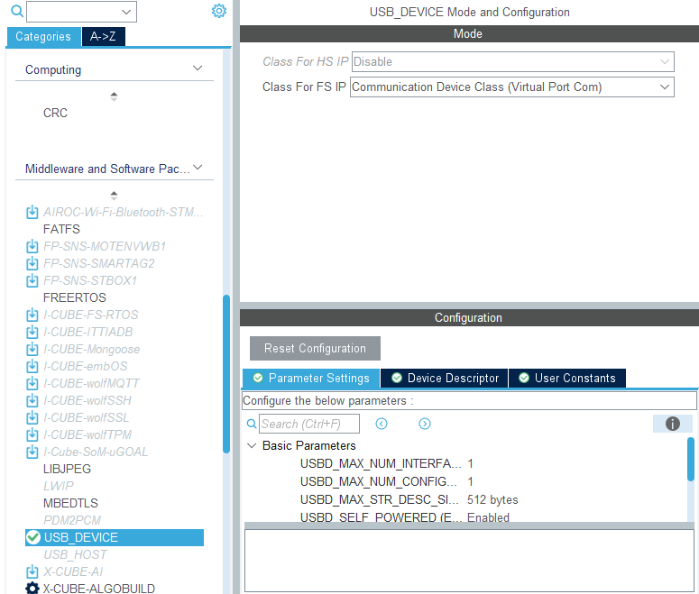

`usbd_cdc_if.c`文件内定义了相关接口。

```c
/**
 * @brief  Data received over USB OUT endpoint are sent over CDC interface
 *         through this function.
 *
 *         @note
 *         This function will issue a NAK packet on any OUT packet received on
 *         USB endpoint until exiting this function. If you exit this function
 *         before transfer is complete on CDC interface (ie. using DMA controller)
 *         it will result in receiving more data while previous ones are still
 *         not sent.
 *
 * @param  Buf: Buffer of data to be received
 * @param  Len: Number of data received (in bytes)
 * @retval Result of the operation: USBD_OK if all operations are OK else USBD_FAIL
 */
static int8_t CDC_Receive_FS(uint8_t *Buf, uint32_t *Len)
{
    /* USER CODE BEGIN 6 */
    USBD_CDC_SetRxBuffer(&hUsbDeviceFS, &Buf[0]);
    USBD_CDC_ReceivePacket(&hUsbDeviceFS);
    return (USBD_OK);
    /* USER CODE END 6 */
}

/**
 * @brief  CDC_Transmit_FS
 *         Data to send over USB IN endpoint are sent over CDC interface
 *         through this function.
 *         @note
 *
 *
 * @param  Buf: Buffer of data to be sent
 * @param  Len: Number of data to be sent (in bytes)
 * @retval USBD_OK if all operations are OK else USBD_FAIL or USBD_BUSY
 */
uint8_t CDC_Transmit_FS(uint8_t *Buf, uint16_t Len)
{
    uint8_t result = USBD_OK;
    /* USER CODE BEGIN 7 */
    USBD_CDC_HandleTypeDef *hcdc = (USBD_CDC_HandleTypeDef *)hUsbDeviceFS.pClassData;
    if (hcdc->TxState != 0) {
        return USBD_BUSY;
    }
    USBD_CDC_SetTxBuffer(&hUsbDeviceFS, Buf, Len);
    result = USBD_CDC_TransmitPacket(&hUsbDeviceFS);
    /* USER CODE END 7 */
    return result;
}
```

> - 当数据包长度小于等于64时，不需要分包接收；当数据包长度大于64时，根据数据包大小分包接收，如果没有设计专门的接收缓存，必须接收完成才能发送。否则，可能会造成后面数据覆盖前面的数据。
